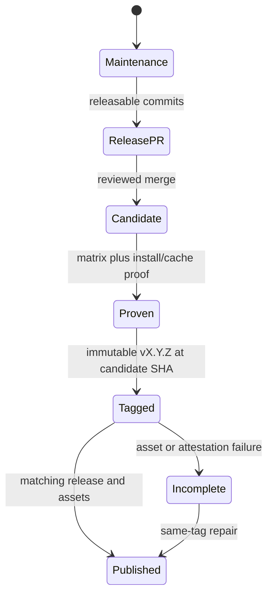
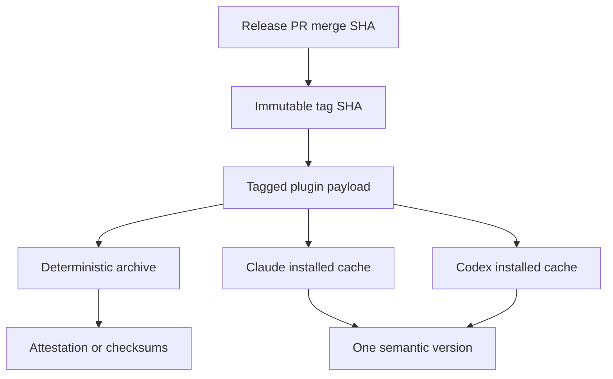
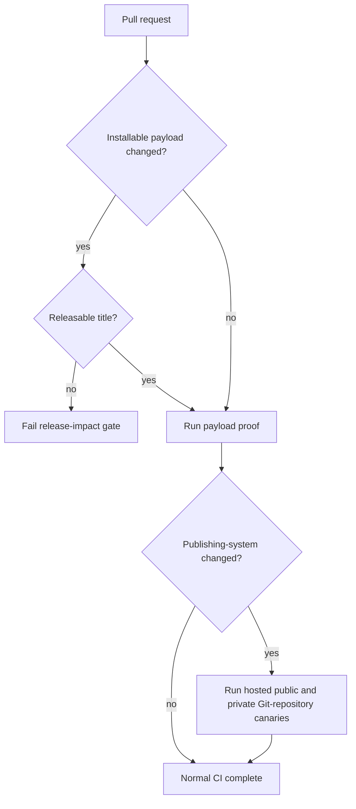

# Plugin Publishing Hardening - Plan

## Goal Capsule

- **Objective:** Make each Claude Code and Codex Git-marketplace release traceable to one reviewed commit, one immutable semantic version, and one mechanically identical plugin payload.
- **Authority:** Official Claude Code plugin documentation, official Codex plugin documentation, this plan's settled decisions, then repository conventions.
- **Execution profile:** Harden the existing release, initialization, packaging, canary, and contributor checks without changing the shared plugin runtime contract.
- **Stop conditions:** Stop before publication when the candidate SHA, tag SHA, payload, manifest version, PR release classification, or repository safeguards cannot be proven.
- **Tail ownership:** The release workflow owns publication. A human owns repository tag rules and repair authorization.

---

## Product Contract

### Summary

Harden the repository template so recipients start from a clean `0.1.0` release lineage and publish the same reviewed payload to Claude Code and Codex under one immutable `vX.Y.Z` tag. Keep automatic marketplace updates under user or team control and keep OpenAI universal-directory submission outside this Git-release path.

### Problem Frame

The current workflow proves the triggering commit, then lets Release Please inspect live `main`. If `main` advances, the created tag can identify different source than the uploaded archive. Initialization also inherits template release state, packaging does not reject symlinks, repair does not bind the tag to the manifest version, and the install guidance crosses the trust boundary after installation.

The two harnesses consume one `plugin/` subtree but apply different marketplace, cache, hook-trust, and refresh behavior. The release contract must preserve those native differences while proving one version and one payload.

### Requirements

#### Release identity and publication

- R1. A release candidate SHA, immutable tag SHA, packaged SHA, and GitHub Release target must be identical before assets are published.
- R2. Normal commits may maintain a Release Please PR, but only a merged release PR may enter the proof, tag, and publication path.
- R3. One semantic version and one `vX.Y.Z` tag must identify both native manifests, Claude's version-bearing marketplace projection, the portable runtime marker, the generated Codex hook definition, and the release assets. The Codex marketplace must remain an identity, source, policy, and category projection with no invented version field; its configured ref and resolved SHA bind it to the release.
- R4. A failed post-tag publication must keep the proven tag and permit only same-tag asset or attestation repair, with compare-before-write behavior and explicit human authority for any mismatched asset replacement.
- R5. A manual repair must reject a missing tag, a tag that does not match the checkout SHA, a tag that differs from `v<manifest version>`, or a GitHub Release that targets another SHA.
- R6. A payload-changing pull request must use a releasable Conventional Commit type: `feat`, `fix`, `perf`, or a breaking form.
- R7. Documentation, tests, CI-only changes, and Release Please's version-only PR are exempt from R6 when they do not alter installable payload behavior.
- R30. Publication-candidate admission must identify exactly one merged Release Please pull request, bind its base branch and merge commit to `github.sha`, validate the expected automation identity and allowed projection, and fail closed on zero, multiple, or differently rebound candidates while permitting idempotent reuse of the exact same candidate record.

#### Payload integrity and evidence

- R8. The GitHub Release archive must contain exactly the regular files and bytes under the tagged `plugin/` subtree, under one deterministic top-level directory.
- R9. Generation, staging, packaging, and distribution proof must reject symlinks, special files, and realpath escapes before copying payload content.
- R10. Private releases must attach `*.checksums.json` containing repository, source commit, immutable tag, plugin version, archive name, archive size, and SHA-256.
- R11. Private checksum metadata must be described as integrity evidence, not independent publisher or builder authenticity.

#### Recipient initialization and repository readiness

- R12. Initializing a recipient must reset all release surfaces to `0.1.0`, clear the Release Please manifest and changelog, and replace the release component name with the recipient plugin identity.
- R13. Repository setup must verify a human-owned immutable `v*` tag ruleset when the GitHub API permits and otherwise fail closed with a precise repair instruction.
- R14. Release automation must not receive repository-administration authority.

#### Harness install, update, and trust

- R15. Production installation, upgrade, and rollback must pin a chosen immutable tag and complete non-mutating source, ref, SHA, credential, policy, and payload preflight before altering the current install. Preserve each host's native state: Claude marketplace and plugin scopes; Codex marketplace identity, source, ref, and plugin `enabled` state.
- R16. The documented flow must inspect a detached copy of the exact tag or SHA, manifests, hooks, binaries, and payload before marketplace admission; inspect the host's pinned marketplace snapshot and installed cache again before the first active session. Codex hook trust and plugin enablement remain separate states.
- R17. Codex hook guidance must reflect that bundled hooks stay untrusted until the user accepts the current definition; Claude guidance must preserve its native trust behavior.
- R18. Codex and Claude must report the same plugin version after a hermetic install, upgrade, or rollback proof, while the proof independently resolves and verifies the pinned Git snapshot SHA against the installed bytes.
- R19. Production documentation must not introduce a moving release channel. Claude automatic updates remain a user or team setting. Codex documents an explicit `marketplace upgrade` CLI operation, but automatic refresh behavior is unspecified; immutable refs must resolve to the same snapshot under either behavior.
- R25. Any Codex release that changes the executable closure of a hook command must change the trusted hook definition so the new closure requires review. The hook definition is a generated, version-bearing release projection and must change through a supported handler field.
- R33. Codex install proof must consume `marketplace add/list --json` and `plugin add/list --json`, record the configured marketplace source and ref, installed marketplace root, plugin version, installed path, enabled state, install policy, and authentication policy, then compare the installed path with the independently resolved tagged inventory.
- R34. Codex replacement must preflight both target and restoration refs under current credentials and managed requirements, capture prior JSON state, and restore the previous marketplace ref and enabled state after failure. If documented operations cannot restore a deleted cache, the workflow must block before destructive mutation rather than claim transactionality.
- R35. Codex local-marketplace proof must treat the cache version as the documented literal `local`, prove repeated installation changes installed bytes through the reported `installedPath`, and never claim that manifest build metadata is the local cache key.
- R37. Codex operator guidance must name the documented plugin surfaces: Codex CLI and Codex in the ChatGPT desktop app. It must not claim plugin availability in the IDE extension, Chat, mobile, or an unspecified Codex host.

#### Claude lifecycle safety

- R26. Claude replacement must preserve `${CLAUDE_PLUGIN_DATA}` with `--keep-data` and restore the previous scoped marketplace and plugin declaration when any post-mutation step fails.
- R27. Claude proof must identify the active installed cache from host state and ignore orphaned version directories retained during Claude Code's 14-day cache grace period.
- R28. Claude private-repository guidance and proof must distinguish SSH agent and known-hosts admission, HTTPS credential-helper admission, token-only failure, background refresh behavior, keep-on-failure retention, and credentialed manual update fallback.
- R29. The generated Claude manifest and marketplace entry must both set `defaultEnabled: false`; installation remains disabled until explicit post-inspection enablement. The compatibility contract must require Claude Code 2.1.154 or later for this safety property and warn that earlier clients ignore it.

#### Canary qualification

- R20. Every release must block on hermetic local Claude and Codex install/cache proof of the tagged payload.
- R21. Hosted public-Git-repository and private-Git-repository canaries must qualify changes to the publishing system, but they must not run for every recipient release or claim universal-directory coverage.
- R22. Canary authorization must prove the Git transport identity used to push, not only the active GitHub CLI account.

#### Native manifest validity

- R23. Canonical metadata validation must enforce every generated Codex package field used by this template, including standards-compliant semantic versioning, field length, one-line, non-empty, uniqueness, and supported-character rules.
- R24. Manifest contract tests must consume the canonical validator rather than reproduce a weaker semantic-version or metadata check.
- R31. The generated Claude plugin must carry the canonical explicit semantic version and pass `claude plugin validate --strict`; its marketplace projection must resolve the same plugin identity, version, and pinned source used by hermetic install proof.
- R32. Canonical URL validation must structurally require HTTPS, a host, no embedded credentials, and no unsupported characters before any generated file is written.
- R36. Codex validation must name two boundaries: the required local/repo Git-marketplace package contract and the stricter directory-readiness metadata subset. Passing the latter must never claim that the deferred ZIP, assets, identity, portal, review, approval, or publication work is complete.

### Acceptance Examples

- AE1. **First recipient release:** Given a template that has already published releases, when a recipient initializes it, then every version surface is `0.1.0`, the release manifest and changelog are empty, and the release component uses the recipient name.
- AE2. **Main advances during maintenance:** Given commit A started a maintenance run and `main` advances to B, when Release Please inspects `main`, then no artifact proven from A can be attached to a tag for B.
- AE3. **Release PR merge:** Given the release PR merge commit passes the full matrix and payload proof, when publication runs, then the created tag, release target, archive, checksum record, and manifests all identify that commit and version.
- AE4. **Repair mismatch:** Given `release_tag=v0.2.0` points to a commit whose manifest says `0.1.0`, when repair starts, then it fails before packaging or asset mutation.
- AE5. **Payload escape:** Given `plugin/` contains a symlink or special file, when generation, development staging, package, or proof runs, then it fails and names the unsafe entry.
- AE6. **Scoped rollback:** Given a project-scoped install at `v0.3.0`, when the operator selects `v0.2.0`, then detached preflight succeeds, persistent data is retained, the marketplace is removed and re-added in project scope, the plugin is reinstalled disabled in project scope, explicit enablement follows snapshot review, and the reported version is `0.2.0`.
- AE7. **Non-releasable payload PR:** Given a `docs:` pull request changes `plugin/`, when PR checks run, then the release-impact gate fails with the accepted releasable title types.
- AE8. **Codex trust boundary:** Given an installed Codex plugin has an untrusted hook definition, when a new task starts, then the hook remains skipped until the user accepts that exact definition.
- AE9. **Codex rollback preflight:** Given the active Codex plugin uses `v0.3.0` and `v0.2.0` is denied by current requirements or cannot be fetched, when rollback is requested, then the active marketplace, cache, and enabled state remain unchanged.
- AE10. **Codex executable closure:** Given a new release changes only a bundled launcher, runtime, or native binary, when generation runs, then the supported hook command field carries the new canonical version and the previous exact-definition trust record cannot authorize it.

### Success Criteria

- The repository cannot publish assets whose source differs from the release tag.
- Fresh recipient repositories always bootstrap at `v0.1.0` regardless of template release history.
- The installed Claude and Codex payloads compare byte-for-byte with the tagged `plugin/` subtree.
- Contributors receive a deterministic PR failure when installable payload changes lack a releasable title.
- Repair, upgrade, rollback, and trust-review instructions are executable without losing native host state or relying on a moving tag.

### Scope Boundaries

- Keep Git-backed Claude and Codex marketplaces as the production repo, team, and private distribution path.
- Keep the GitHub Release archive as verified mirror and recovery evidence, not a second canonical payload.
- Keep one shared plugin payload with native manifests and native hook files.
- Keep user and workspace automatic-update policy outside repository control.

#### Deferred to Follow-Up Work

- Build and submit the separate ZIP and portal materials required for OpenAI's universal public Plugins Directory. That follow-up owns ZIP root, member, size, and normalization limits; logo and composer assets; verified publisher identity; Apps Management write access; five positive and three negative review cases; scans; review; approval; and the separate portal publish action. The Git-marketplace tarball and public-Git canary do not claim to satisfy that path.
- Submit to Anthropic's `claude-community` marketplace. That separate path requires `claude plugin validate`, Anthropic's submission form and safety review, and catalog SHA pinning; self-hosted Git marketplace releases do not imply community publication.
- Add signed private provenance when a supported private-repository signing route exists. Until then, publish checksum metadata only.

### Assumptions

- GitHub ruleset read APIs are available to the repository setup verifier for normal GitHub-hosted recipients; unavailable or unauthorized responses block readiness rather than weakening the tag policy.
- Release Please's release PR can be identified from its manifest output and merge commit without granting the release workflow administrator permissions.
- Hermetic Codex install proof may use the current CLI marketplace browser or commands, but it must verify the resulting cached copy under the documented versioned cache model.

---

## Planning Contract

### Key Technical Decisions

- KTD1. **Separate maintenance from publication.** Run Release Please maintenance on ordinary `main` commits. Run proof and publication from the release PR merge SHA only. (session-settled: user-directed — chosen over proving one commit while Release Please tags live `main`: the race can attach the wrong payload to a release) Governs R1-R5.
- KTD2. **Treat the immutable Git tag as the published product.** Install both harnesses from the tag. Treat the release archive as a mechanically equivalent mirror. (session-settled: user-directed — chosen over treating the archive as a separate canonical product: both harnesses install the Git payload) Governs R1, R3, R8.
- KTD3. **Protect tags outside the workflow and verify them inside it.** A human creates the `v*` tag ruleset. Setup and release checks fail closed when immutability or SHA binding is unproven. (session-settled: user-directed — chosen over giving the workflow repository-admin authority: publication must not be able to weaken its own safeguards) Governs R1, R13-R14.
- KTD4. **Reset recipient release lineage during initialization.** Write `0.1.0` across all version surfaces, empty the release manifest and changelog, and rename the release component. (session-settled: user-directed — chosen over inheriting template release history: a recipient's first release must remain `v0.1.0`) Governs R12.
- KTD5. **Use one strict payload walker.** Make generation, staging, packaging, and proof share a regular-file-only inventory that resolves every path inside `plugin/`. (session-settled: user-directed — chosen over prose-only payload isolation: future symlinks can cross the install boundary) Governs R8-R9.
- KTD6. **Classify payload impact at pull-request time.** Compare the pull request base and head, exempt Release Please's version-only projection, and require a releasable title for any other installable payload change. (session-settled: user-directed — chosen over releasing every maintenance change or trusting title convention alone: payload changes need a mechanical release signal) Governs R6-R7.
- KTD7. **Inspect before marketplace admission and preserve native state through replacement.** Document detached preflight, pinned re-add, host-snapshot inspection, installation, native activation and trust state, and version verification. Preserve Claude scopes and data through its native flow; preserve Codex source/ref and `enabled` state through its separate flow. (session-settled: user-directed — chosen over install-then-review and state-defaulting commands: hooks and cache contents cross a trust boundary) Governs R15-R19.
- KTD8. **Split hermetic release proof from hosted canary qualification.** Block every release on local install/cache proof. Require public and private hosted canaries only when publishing-system paths change. (session-settled: user-directed — chosen over running hosted canaries for every recipient release: canaries qualify the template machinery, while hermetic proof protects each release) Governs R20-R22.
- KTD9. **Name checksum evidence accurately.** Replace `provenance` with `checksums` and bind it to repository, tag, commit, version, filename, size, and digest. (session-settled: user-directed — chosen over calling unsigned same-workflow metadata provenance: it proves integrity but not independent authenticity) Governs R10-R11.
- KTD10. **Keep production channels pinned.** Do not create a moving stable tag or repository-controlled automatic-update setting. (session-settled: user-directed — chosen over silently moving users to new releases: update cadence belongs to the user or workspace) Governs R15, R19.
- KTD11. **Use immutable per-candidate refs for hosted qualification.** Push the publishing-system pull request SHA to the private canary. Push a deterministic installable-only root commit with a trusted minimal proof workflow to the public canary so private repository source and history cannot leak. Give each published commit its own candidate ref. Never advance one shared canary branch to qualify unmerged work. Governs R21-R22.
- KTD12. **Own native manifest validation in canonical metadata code.** Validate the local/repo package contract once in `scripts/plugin-config.ts`, label the optional directory-readiness text limits separately, run the Claude strict validator against rendered output, and make tests exercise those owners rather than copying weaker checks. Governs R23-R24, R31-R32, R36.
- KTD13. **Bind Codex hook trust to the released executable closure.** Generate each Codex hook command with `--plugin-version <version>` and make the launcher validate that argument. Own the hook file in initialization, generation drift, Release Please projection, candidate admission, and release validation so every released executable closure produces a new exact-definition hash. Governs R3, R17, R25.
- KTD14. **Compare before release repair.** Add missing assets, leave matching assets untouched, and stop on mismatched existing bytes unless a human uses the explicit protected replacement path for the same immutable tag. Governs R4-R5, R10-R11.
- KTD15. **Make Claude replacement transactional and data-preserving.** Preflight the detached source and exact managed-policy admission; capture scopes and current state; uninstall with `--keep-data`; remove and re-add the marketplace in its original scope; inspect, install, and enable in the original plugin scope; restore the prior declaration and install after any post-mutation failure. Governs R15-R16, R26-R28.
- KTD16. **Ship Claude plugins disabled by default.** Use `defaultEnabled: false` as defense in depth after source inspection, never as a substitute for trust-before-install, and enforce or warn on the Claude Code 2.1.154 compatibility boundary. Governs R16-R17, R29.
- KTD17. **Represent publication admission as a unique candidate record.** Bind repository, base branch, pull-request number, automation identity, merge commit, version, expected tag, and allowed projection before proof; reject ambiguous records or rebinding while allowing an exact record to resume its existing state machine. Governs R1-R5, R30.
- KTD18. **Model Codex replacement with Codex state.** Capture marketplace identity/source/ref and plugin version/path/enabled/policy from JSON, preflight target and restoration refs, mutate through remove/re-add/install, and restore the prior pinned state after injected failure. Never project Claude scopes or default-disabled installation onto Codex. Governs R15-R16, R33-R35.
- KTD19. **Take Codex evidence from native JSON surfaces.** Resolve the configured marketplace root and installed plugin path from documented command output, then verify Git identity and bytes at those paths. Do not discover the active state by guessing cache directories. Governs R18, R20, R33, R35.

### High-Level Technical Design

#### Release lifecycle

#### Identity chain

#### Qualification gates

### Sequencing

1. Establish reusable payload, native-metadata, release-identity, and recipient-bootstrap contracts.
2. Bind workflow states and repair behavior to those contracts.
3. Add PR impact and repository-readiness gates.
4. Add hermetic harness proof and conditional hosted canaries.
5. Rewrite operator documentation from the proven commands and states.

### Sources and Research

- Current release and recovery behavior: `.github/workflows/release.yml`, `scripts/release-validate.ts`, and `docs/adr/0003-reviewed-versioned-releases.md`.
- Current payload and installation boundaries: `scripts/plugin-files.ts`, `scripts/package.ts`, `scripts/prove-distribution.ts`, `scripts/prove-dx.ts`, and `README.md`.
- Official Codex package and marketplace contract: [Package your plugin](https://developers.openai.com/plugins/build/plugins).
- Official Codex install and trust behavior: [Plugins](https://learn.chatgpt.com/docs/plugins).
- Official Codex CLI marketplace, plugin, and JSON evidence surfaces: [CLI command reference](https://learn.chatgpt.com/docs/developer-commands?surface=cli).
- Official Codex exact-definition hook trust behavior: [Hooks](https://learn.chatgpt.com/docs/hooks).
- Official Codex public-directory validation rules: [Plugin submission errors](https://developers.openai.com/plugins/deploy/submission-errors).
- Official Codex public review and publishing path: [Submit plugins](https://developers.openai.com/plugins/deploy/submission).
- Official Claude marketplace, version, cache, and private-repository behavior: [Plugin marketplaces](https://code.claude.com/docs/en/plugin-marketplaces) and [Plugins reference](https://code.claude.com/docs/en/plugins-reference).
- Official Claude installation, security, scope, and auto-update behavior: [Discover and install plugins](https://code.claude.com/docs/en/discover-plugins).
- Official Claude self-hosted and community-publication boundary: [Create plugins](https://code.claude.com/docs/en/plugins#submit-your-plugin-to-the-community-marketplace).

---

## Implementation Units

### U1. Reset recipient release lineage

- **Goal:** Make initialization create a new recipient release history instead of copying the template's history.
- **Requirements:** R3, R12; Covers AE1; KTD4.
- **Dependencies:** None.
- **Files:** `scripts/init.ts`, `scripts/init.test.ts`, `scripts/plugin-config.ts`, `.github/release-please-config.json`, `.github/.release-please-manifest.json`, `CHANGELOG.md`, `package.json`, `plugin.config.json`, `.claude-plugin/marketplace.json`, `plugin/.claude-plugin/plugin.json`, `plugin/.codex-plugin/plugin.json`, `plugin/hooks/codex/hooks.json`, `plugin/runtime/hello-world.js`.
- **Approach:** Extend initialization ownership from identity projections to the complete release bootstrap, including the version-bearing Codex hook definition. Keep dry-run side-effect free and report every reset file in its result.
- **Patterns to follow:** `renderGeneratedFiles` and existing temporary-template initializer tests.
- **Test scenarios:**
  - Covers AE1. Initialize a synthetic template at a later released version and verify every recipient surface is `0.1.0`, the release manifest and changelog are empty, and the release package name equals the recipient name.
  - Verify recipient initialization generates Codex hook commands with `--plugin-version 0.1.0` and includes the hook file in the reported reset surfaces.
  - Reinitialize an existing recipient without `--force` and verify no release file changes.
  - Run `--dry-run` against a released template and verify it reports the reset plan without changing bytes.
- **Verification:** A freshly initialized copied repository passes generation, release validation, package, and full proof as a bootstrap release.

### U2. Enforce one safe payload inventory

- **Goal:** Make every copy and package operation consume the same regular-file-only inventory rooted inside `plugin/`.
- **Requirements:** R8-R9; Covers AE5; KTD2, KTD5.
- **Dependencies:** None.
- **Files:** `scripts/plugin-files.ts`, `scripts/plugin-files.test.ts`, `scripts/package.ts`, `scripts/prove-distribution.ts`, `scripts/prove-dx.ts`, `scripts/dev.ts`.
- **Approach:** Centralize path discovery, file-type validation, realpath containment, deterministic ordering, and copy behavior. Compare archive members and extracted bytes to the inventory rather than a hand-maintained required-file list alone.
- **Execution note:** Add failure-path coverage before replacing existing copy logic.
- **Patterns to follow:** Existing deterministic ordering in `scripts/package.ts` and digest checks in `scripts/prove-distribution.ts`.
- **Test scenarios:**
  - Covers AE5. Add an internal symlink, external symlink, broken symlink, FIFO, and nested realpath escape in isolated fixtures; verify each consumer rejects the exact entry.
  - Copy a valid payload and verify modes, paths, and file bytes match the source inventory.
  - Package twice and verify identical archive bytes and exact file-set equality with `plugin/`.
  - Add an unexpected regular file and verify it is included consistently in Git installation evidence and the archive rather than silently omitted.
- **Verification:** Development staging, packaging, extraction, and both harness distribution proofs share one inventory and no path type can produce different installed and archived bytes.

### U9. Match native package metadata rules

- **Goal:** Prevent the generator from accepting metadata that either native plugin validator or marketplace contract rejects.
- **Requirements:** R23-R24, R29, R31-R32, R36; KTD12, KTD16.
- **Dependencies:** U1.
- **Files:** `scripts/plugin-config.ts`, `scripts/plugin-manifest-contract.test.ts`, `scripts/init.test.ts`, `plugin.config.json`, `.claude-plugin/marketplace.json`, `.agents/plugins/marketplace.json`, `plugin/.claude-plugin/plugin.json`, `plugin/.codex-plugin/plugin.json`, `plugin/hooks/codex/hooks.json`.
- **Approach:** Make canonical metadata validation own the published native rules for every emitted field. Use one standards-compliant semantic-version check with the 64-character limit. Name the required `package/git-marketplace` profile separately from the intentionally stricter `directory-readiness` text profile. Enforce package structure and supported text for the first; keep the current 30-character display and short-description and 128-character prompt limits as deliberate directory-ready metadata without claiming submission completeness. Structurally parse URLs before rendering. Run Claude's strict plugin validator against the rendered plugin and bind its explicit version and marketplace identity to the canonical config. Generate the version-bearing Codex hook definition from the same config.
- **Patterns to follow:** Existing table-driven negative manifest cases in `scripts/plugin-manifest-contract.test.ts` and generated-file drift checks.
- **Test scenarios:**
  - Reject semantic versions with leading-zero numeric identifiers, invalid prerelease or build identifiers, missing components, or more than 64 characters; accept representative valid stable, prerelease, and build forms.
  - Reject descriptions over 1,024 characters or containing unsupported control text.
  - Reject repository URLs outside the canonical GitHub HTTPS shape used by release publication, including other hosts, ports, queries, fragments, embedded credentials, unsupported text, or a non-HTTPS scheme.
  - Reject empty, whitespace-only, multiline, duplicate-after-normalization, over-limit, or `@mention` starter prompts.
  - Verify author, developer, display, short-description, long-description, category, and capability limits remain aligned with the generated Codex manifest.
  - Verify the generated Codex marketplace keeps `policy.installation` at `AVAILABLE` and never silently opts recipients into `INSTALLED_BY_DEFAULT`.
  - Verify the Codex marketplace contains no synthetic version field; prove its identity, source, policy, and category projection separately from manifest version.
  - Verify the generated Claude manifest and marketplace entry both set `defaultEnabled: false` and document Claude Code 2.1.154 as the minimum version for disabled-on-install behavior.
  - Verify the generated Claude plugin passes `claude plugin validate --strict`, carries the canonical explicit version, and agrees with the marketplace plugin name and source projection.
  - Hold the Claude manifest version constant while changing payload bytes and verify the release-impact and generated-drift gates reject the update before Claude can reuse the old cache key.
  - Verify the generated Codex hook commands include and validate the canonical `--plugin-version` argument.
  - Verify the named directory-readiness text subset passes its enumerated limits while the result explicitly reports public ZIP, assets, identity, portal review, approval, and publication as not evaluated.
  - Verify initializer input cannot write invalid metadata or leave partially regenerated manifests.
- **Verification:** Every generated native manifest fixture passes its named package profile, Claude strict validation succeeds, Codex directory-ready text fields pass their separate profile, and neither result overclaims public-directory readiness.

### U3. Bind proof, tag, release, and repair to one commit

- **Goal:** Remove the live-`main` race and make repair mutate assets only for the already proven tag.
- **Requirements:** R1-R5, R10-R11, R30; Covers AE2-AE4; KTD1-KTD3, KTD9, KTD17.
- **Dependencies:** U2, U9.
- **Files:** `.github/workflows/release.yml`, `.github/workflows/plugin-ci.yml`, `.github/release-please-config.json`, `scripts/plugin-config.ts`, `scripts/release-validate.ts`, `scripts/release-validate.test.ts`, `scripts/package.ts`, `scripts/prove-distribution.ts`, `plugin/hooks/codex/hooks.json`, `package.json`.
- **Approach:**
  1. Configure Release Please to maintain the release pull request without creating the Git tag or GitHub Release.
  2. Resolve exactly one merged Release Please pull request for `github.sha`. Require the configured base branch, the expected automation identity, exact merge-commit equality, and only the allowed version, manifest, generated Codex hook definition, runtime marker, and changelog projection. Reject zero or multiple matches, unsupported merge modes, and replay of a candidate already bound to another release state.
  3. Persist a candidate record containing repository, base branch, pull-request number, automation identity, merge commit, version, expected absent `vX.Y.Z` tag, and projection digest before proof begins.
  4. Run compatibility, metadata, exact-payload, and hermetic harness proof against that candidate SHA even if `main` later advances.
  5. Create the immutable tag explicitly at the proven candidate SHA, verify the remote tag target, then create the GitHub Release for that existing tag and upload the candidate's assets.
  6. Enter `incomplete publication` when the tag exists but release creation, asset upload, or attestation fails. Repair starts from the existing tag, compares remote and regenerated digests, adds missing evidence, and leaves matching evidence untouched.
  7. Stop on a mismatched existing archive or checksum record. Permit replacement only through an explicit same-tag human-authorized input protected by the repository's release environment; generate evidence for the corrected digest without moving the tag.
- **Patterns to follow:** Full-SHA action pins, narrow job permissions, and current deterministic repair upload.
- **Test scenarios:**
  - Covers AE2. Model maintenance at SHA A while `main` advances to B; verify no A artifact can publish under B's release.
  - Present an ordinary `main` commit, a hand-authored version bump, and a Release Please PR with an extra payload edit; verify none qualifies as a publication candidate.
  - Present zero matching PRs, multiple matching PRs, the wrong base, wrong automation identity, non-equal merge commit, unsupported merge mode, and a candidate rebound to another release identity; verify every case fails before proof or mutation. Resume the identical candidate record and verify idempotent continuation.
  - Present a Release Please projection that omits or hand-edits the generated version-bearing Codex hook file; verify candidate admission and release validation fail.
  - Covers AE3. Publish a release PR merge candidate and verify tag name, tag target, release target, archive metadata, and manifest version agree.
  - Covers AE4. Supply a valid existing tag with the wrong manifest version, wrong checkout SHA, or wrong release target; verify failure precedes asset mutation.
  - Rerun each transition after it succeeds and verify it is a no-op or same-tag completion, never a second tag or release.
  - Simulate archive upload or public attestation failure after tag creation; verify rerun adds only the missing evidence for the same immutable tag.
  - Present an existing matching archive, a mismatched archive, a missing checksum paired with an archive, and a mismatched checksum/archive pair; verify no-op, fail-closed, or protected human replacement behavior as specified by KTD14.
  - Rerun a fully published release and verify no release asset or evidence is rewritten.
  - Verify private output is named `*.checksums.json` and contains every R10 field.
- **Verification:** Workflow contract tests exercise maintenance, candidate admission, proof, tag creation, publication, incomplete publication, and repair transitions. No transition can reach tag or asset mutation with an unbound SHA.

### U4. Gate payload changes on releasable pull request intent

- **Goal:** Prevent installable changes from merging under a title that Release Please will not version.
- **Requirements:** R6-R7; Covers AE7; KTD6.
- **Dependencies:** U1, U2.
- **Files:** `scripts/release-impact.ts`, `scripts/release-impact.test.ts`, `.github/workflows/pull-request-title.yml`, `.github/workflows/plugin-ci.yml`, `.github/release-please-config.json`, `README.md`.
- **Approach:** Classify the base-to-head diff by canonical payload and generated-source ownership. Exempt non-payload changes and the recognized Release Please version projection. Emit the accepted title classes and changed payload paths on failure.
- **Patterns to follow:** Existing conventional-title check and generated-file ownership in `scripts/plugin-config.ts`.
- **Test scenarios:**
  - Covers AE7. Change a skill, hook, launcher, runtime asset, or native manifest under `docs:`, `test:`, `ci:`, `chore:`, or `refactor:` and verify failure.
  - Change only documentation, tests, or CI and verify a non-releasable title passes.
  - Change a payload source plus its generated output under `fix:` and verify success.
  - Present the exact Release Please version and changelog projection and verify the exemption; add any unrelated payload change and verify the exemption disappears.
  - Use breaking, scoped `feat`, `fix`, and `perf` titles and verify each accepted form.
- **Verification:** The required PR check fails deterministically before merge whenever release-bearing bytes lack a version-bearing title.

### U5. Verify repository publication safeguards

- **Goal:** Make tag immutability and repository readiness visible, human-owned prerequisites.
- **Requirements:** R13-R14; KTD3.
- **Dependencies:** U3.
- **Files:** `scripts/repository-readiness.ts`, `scripts/repository-readiness.test.ts`, `package.json`, `README.md`, `docs/adr/0003-reviewed-versioned-releases.md`.
- **Approach:** Add a read-only verifier for the `v*` tag ruleset, default branch, merge mode, Actions permissions, and required checks that this release design depends on. Return a fail-closed result with exact settings repair guidance when a safeguard is absent or unqueryable.
- **Patterns to follow:** Structured errors and next actions in `scripts/ship-canary.ts`.
- **Test scenarios:**
  - Report ready when a fixture repository exposes immutable `v*` tags and expected branch protections.
  - Report the missing rule and settings path for an absent, disabled, bypassable, or mutable tag ruleset.
  - Return a distinct unauthorized or API-unavailable result without claiming the repository is safe.
  - Verify workflow permissions never include repository administration.
- **Verification:** A maintainer can run one read-only readiness check before enabling release automation, and publication cannot pass by treating an unknown safeguards state as ready.

### U6. Prove native install, cache, trust, update, and rollback behavior

- **Goal:** Verify that both harnesses install the tagged payload, report the same version, and preserve native trust and refresh rules.
- **Requirements:** R15-R20, R25-R29, R33-R35; Covers AE6, AE8-AE10; KTD2, KTD7, KTD10, KTD13, KTD15-KTD16, KTD18-KTD19.
- **Dependencies:** U2, U3, U9.
- **Files:** `scripts/prove-harness-install.ts`, `scripts/prove-harness-install.test.ts`, `scripts/prove-distribution.ts`, `scripts/prove-dx.ts`, `scripts/dev.ts`, `scripts/dev.test.ts`, `scripts/plugin-config.ts`, `scripts/plugin-manifest-contract.test.ts`, `scripts/readme-release-pin.test.ts`, `plugin/hooks/codex/hooks.json`, `README.md`, `package.json`.
- **Approach:** Build isolated harness homes and Git marketplace fixtures for a tagged release. Before mutation, clone or fetch a detached candidate, independently resolve requested ref to a 40-character SHA, validate exact-ref managed-policy admission and transport credentials, and inspect its manifest version and regular-file inventory. For Claude, record requested ref, resolved SHA, manifest version, active cache path, and installed inventory; preserve scoped state through KTD15. For Codex, capture `marketplace add/list --json` and `plugin add/list --json`; record marketplace identity, configured source/ref, installed marketplace root, plugin version, installed path, enabled state, install policy, and authentication policy. Preflight both target and previous refs under current requirements before removing the plugin or marketplace. Re-add the target ref, install, compare the reported `installedPath` with the tagged inventory, then start an isolated inspection task where the untrusted hook is skipped. Review and trust the exact version-bearing definition through `/hooks`, restore the captured enabled state through `/plugins`, and start a second task for activation proof. Inject failures after each mutation and restore the previous pinned state; block before removal if recovery cannot be proven. For local Codex development, treat the cache version as `local` and prove installed-byte replacement at the reported path rather than using manifest build metadata as a cache key. Detect managed or non-removable plugin state and hand off to the workspace administrator instead of promising rollback.
- **Execution note:** Prefer hermetic local homes and repositories; never mutate the developer's real plugin settings or cache.
- **Patterns to follow:** Isolated environment and staged Codex development setup in `scripts/dev.ts`.
- **Test scenarios:**
  - Install one tag into isolated Claude and Codex homes and compare both cached payloads byte-for-byte with the tagged `plugin/` inventory.
  - Covers AE6. Upgrade and roll back user, project, and local Claude scopes where supported; verify the selected scope and reported version after each replacement.
  - Seed `${CLAUDE_PLUGIN_DATA}` with a marker, replace the last installed Claude scope, and verify `--keep-data` preserves the marker through upgrade, rollback, and restoration.
  - Fail detached source access, credential admission, ref resolution, exact-ref policy admission, and payload inspection; verify the current install remains untouched.
  - Fail each step after Claude mutation begins; verify the previous marketplace and plugin declarations return in their original scopes, persistent data survives, and no partially enabled replacement remains.
  - Leave old Claude cache versions orphaned beside the active version; verify proof selects only the host-reported active cache and still reports requested ref, resolved SHA, manifest version, active path, and exact inventory.
  - Prove SSH private access requires accepted host keys and an agent-loaded key; prove HTTPS requires a credential helper; prove token environment variables alone do not satisfy Git admission.
  - Simulate private HTTPS background pull failure and re-clone behavior; verify keep-on-failure retains the last-known-good marketplace and the documented manual update path succeeds with configured credentials.
  - Install the Claude manifest with `defaultEnabled: false`, verify no hook runs before explicit enablement, and verify the compatibility check warns or rejects clients older than 2.1.154.
  - Upgrade and roll back a Codex Git marketplace snapshot; verify a fresh task sees the selected version and payload.
  - Capture Codex marketplace and plugin JSON before replacement; verify source/ref, roots, installed path, version, enabled state, and policies match the active installation.
  - Reject a target or restoration ref denied by current requirements or unavailable under current credentials before deleting the installed plugin or marketplace.
  - Fail after Codex plugin removal, marketplace removal, pinned re-add, and plugin install; verify the previous ref and enabled state are restored, or verify the transition was blocked because cache restoration was not provable.
  - Reinstall a changed local development payload whose host cache version is `local`; verify the reported `installedPath` bytes change. Remove and add explicitly if repeated `plugin add` does not prove replacement.
  - Covers AE8. Install a Codex plugin with hooks, start an isolated inspection task, verify the exact current hook definition is skipped as untrusted, trust it through `/hooks`, then start a second task and verify the trusted definition runs.
  - Change only the portable JavaScript, launcher, and each bundled native binary under a new version while leaving hook behavior stable; verify `--plugin-version` changes the generated command and prior trust does not authorize the new exact-definition hash.
  - Verify Codex `enabled` state and hook trust independently: an enabled plugin with untrusted hooks skips those hooks, and trust alone does not invent a default-disabled installation contract.
  - Attempt replacement of a managed, workspace-installed, or non-removable plugin and verify a clear administrator handoff with no partial marketplace mutation.
  - Attempt inspection or install from a moved or mismatched ref and verify the immutable-tag and commit checks fail.
- **Verification:** Every release blocks on isolated end-to-end install and cache evidence for both harnesses, with no writes to the operator's real harness state.

### U7. Qualify publishing-system changes with hosted Git-repository canaries

- **Goal:** Run public-Git-repository and private-Git-repository hosted canaries when the template's publication machinery changes and prove the real Git transport identity.
- **Requirements:** R21-R22; KTD8, KTD11.
- **Dependencies:** U3-U6.
- **Files:** `scripts/ship-canary.ts`, `scripts/ship-canary.test.ts`, `.github/workflows/plugin-ci.yml`, `README.md`.
- **Approach:** Classify publishing-system paths, require both canary conclusions for those pull requests, and keep recipient releases on hermetic proof alone. Verify generated files in unprivileged PR CI with the candidate generator; keep the privileged base-code driver limited to stable target and transport invariants. Bind authorization and both native installs to the transport derived from `origin`. Publish the source SHA to the private canary and a deterministic installable-only root commit with a trusted minimal proof workflow to the public canary. Trigger proof from each unique immutable ref, then install through each harness and compare its cache to the exact published commit. Do not delete or reuse candidate refs in this unit; define retention cleanup separately after qualification is stable.
- **Patterns to follow:** Existing visibility, lineage, fast-forward-only, and hosted-run checks in `scripts/ship-canary.ts`.
- **Test scenarios:**
  - Change packaging, release, initialization, manifest generation, install proof, or canary code and verify both hosted canaries become required.
  - Change only a recipient payload and verify hosted canaries are not required while hermetic proof still runs.
  - Qualify parallel and mutually divergent pull request heads and verify each uses a distinct candidate ref without rewriting or blocking the other.
  - Retry one candidate SHA and verify the existing ref is accepted only when it resolves to the same commit.
  - Use a GitHub CLI identity that differs from the SSH or HTTPS push identity and verify preflight fails before repository mutation.
  - Publish public and private Git-repository canaries, install each through native marketplace flow, and compare version, commit, and cached payload without reporting universal-directory qualification.
  - Simulate missing repository, non-fast-forward history, wrong visibility, failed hosted CI, and install mismatch; verify each returns a repair action without rewriting history.
- **Verification:** Publishing-system pull requests cannot merge until public and private Git-repository distribution paths pass, while ordinary recipient releases avoid unnecessary hosted canary fan-out. These canaries make no claim about universal-directory ZIP validation, review, approval, or publication.

### U8. Align operator documentation and architectural contract

- **Goal:** Make README and ADR guidance describe only behavior the implementation proves.
- **Requirements:** R3-R5, R10-R11, R15-R22, R26-R37; KTD1-KTD10, KTD15-KTD19.
- **Dependencies:** U1-U7, U9.
- **Files:** `README.md`, `docs/adr/0003-reviewed-versioned-releases.md`, `scripts/readme-release-pin.test.ts`, `scripts/release-validate.test.ts`.
- **Approach:** Document the release states, human-owned safeguards, detached-source trust preflight, each host's native replacement state, Claude data preservation, Codex JSON evidence and best-effort restoration boundary, incomplete-publication repair, checksum limits, Git-repository canary qualification, private-repository authentication, supported Codex surfaces, and the self-hosted Git marketplace versus OpenAI-directory and Anthropic-community boundaries. Derive command assertions from complete ordered recipes. Keep plugin removal and marketplace removal as distinct Codex steps.
- **Patterns to follow:** Existing public and private install sections and release-state diagram.
- **Test scenarios:**
  - Parse each public and private Claude recipe and verify the order is detached source/ref/SHA/credential/policy/payload preflight, scoped plugin uninstall with `--keep-data`, scoped marketplace removal, pinned marketplace add in the original marketplace scope, host-snapshot inspection, scoped install, explicit enable, and version and active-cache verification where replacement applies.
  - Parse each public and private Codex replacement recipe and verify the order is detached target and restoration preflight, JSON state capture, plugin removal, marketplace removal, pinned marketplace add, marketplace JSON/root inspection, plugin add, plugin JSON/installed-path inspection, isolated inspection task with hooks skipped, `/hooks` trust review, enabled-state restoration, second fresh task, and version and byte verification.
  - Verify every Claude scope variant preserves the same scope through remove and reinstall.
  - Verify every Claude failure path restores the prior scoped declaration and install without deleting persistent plugin data.
  - Verify Claude private recipes distinguish SSH agent and known-hosts setup, HTTPS credential helpers, insufficient token-only setup, background keep-on-failure, and manual updates.
  - Verify the Claude compatibility note states that clients older than 2.1.154 ignore `defaultEnabled: false`.
  - Verify production examples contain immutable `vX.Y.Z` refs and no moving release channel.
  - Verify Claude automatic-update controls are described as user or team policy; describe `codex plugin marketplace upgrade` as the documented explicit CLI operation and automatic Codex refresh as unspecified.
  - Verify Codex instructions preserve marketplace source/ref and `enabled` state, never claim plugin scopes or default-disabled install, and stop before destructive replacement when the prior cache cannot be restored.
  - Verify Codex use is limited to documented supported surfaces: Codex CLI and Codex in the ChatGPT desktop app, not the IDE extension, Chat, mobile, or an unspecified universal Codex host.
  - Verify managed or workspace-installed plugins route to an administrator instead of claiming universal removal or rollback.
  - Verify repair instructions name only an exact existing tag and distinguish incomplete publication from a new release.
  - Verify private evidence is consistently called checksum metadata, public/private Git canaries do not imply OpenAI-directory submission, and Anthropic community submission remains a separate deferred path.
- **Verification:** A reader can install, inspect, upgrade, roll back, publish, or repair without inventing a missing command or crossing a trust boundary prematurely.

---

## Verification Contract

| Gate | Applies to | Done signal |
|---|---|---|
| `bun test` | U1-U9 | All behavioral, workflow-state, fixture, and documentation contract tests pass. |
| `bun run generate:check` | U1, U4, U6 | Both marketplaces and native manifests match canonical metadata. |
| `bun run release:validate -- --json` | U1, U3-U5, U8 | Output binds one version, tag, release state, and required safeguards without drift. |
| `bun run prove:distribution` | U2-U3, U6 | Two archives are deterministic and exactly match the tagged regular-file payload. |
| Hermetic harness install proof | U6 | Isolated Claude and Codex active caches match the independently resolved tag SHA; Codex evidence uses documented JSON roots, installed path, version, enabled state, and policy fields. |
| Hosted public/private Git canaries | U7 | Required publishing-system changes pass both native Git-repository distribution paths without claiming universal-directory coverage. |
| `bun run prove:all` | All | The complete local gate passes with no generated drift or writes to real harness state. |

---

## Risks and Dependencies

- Codex plugin surfaces are evolving. Keep manifest, cache, hook-trust, and marketplace assertions tied to current official documentation and behavior fixtures.
- Codex trust keys the hook definition, not every downstream executable. Version-binding the definition depends on R6 ensuring every executable payload change receives a release version.
- Codex marketplace metadata has no general version field. Keep release version in the native manifest and bind the marketplace through configured ref, resolved SHA, and installed bytes.
- Codex local marketplace cache paths use the literal version `local`. Manifest build metadata may remain useful diagnostic output but is not cache invalidation evidence.
- Codex documents `marketplace upgrade` as an explicit CLI action but does not specify every host's automatic refresh behavior. Keep refs immutable and avoid broader claims.
- Claude and Codex may not expose identical scope controls. Preserve each native interface and do not claim symmetry where the host does not provide it.
- Claude Code treats an explicit manifest version as its update and cache identity; a payload commit with an unchanged version can be skipped. Keep R3's version-impact gate and verify manifest version before accepting cache reuse.
- Claude Code retains orphaned cache directories for 14 days. Never infer the active installation by choosing the newest or only cache directory.
- Claude Code clients before 2.1.154 ignore `defaultEnabled: false`. Enforce the supported-client boundary anywhere disabled-on-install is presented as a security property.
- Private Claude marketplace refresh depends on Git transport configuration. Keep token material out of source, preserve the last-known-good clone on failure, and offer credentialed manual update as recovery.
- GitHub ruleset APIs and permissions vary by repository ownership. Unknown safeguard state must block readiness with a repair path.
- Release Please output shape is an external contract. Pin the action SHA and cover the used outputs with workflow-state tests.
- Hosted private canaries require safe credentials. Keep secrets outside source and test identity admission before any push.

---

## Definition of Done

- Every requirement is implemented and traced to passing tests.
- Candidate SHA, tag SHA, archive bytes, installed cache bytes, version, and release target agree for a representative release.
- Publication admission is a unique, replay-safe Release Please candidate record whose merge commit equals the workflow SHA.
- Recipient initialization from a synthetic post-release template produces a valid first `v0.1.0` release state.
- Unsafe payload entries fail every copy and publication path.
- Payload-changing pull requests cannot merge under a non-releasable title.
- Generated Codex metadata rejects every enumerated local/repo package violation before files are written and labels the stricter directory-ready text subset without claiming submission readiness.
- Codex proof derives marketplace root, installed path, version, enabled state, and policies from native JSON, then proves Git identity and installed bytes at those exact paths.
- Codex upgrade and rollback preserve the prior source/ref and enabled state after injected failures, or stop before destructive mutation when restoration cannot be proven.
- Every release changes the supported Codex hook command field through the canonical version projection; prior exact-definition trust does not authorize the new executable closure.
- Repository safeguards are human-owned, machine-verified, and fail closed when unproven.
- Claude upgrade and rollback preserve marketplace scope, plugin scope, and `${CLAUDE_PLUGIN_DATA}`, restore the prior state after injected failure, and ignore orphaned cache directories.
- Claude installs remain disabled until the reviewed snapshot is explicitly enabled on supported clients; older clients fail the compatibility promise clearly.
- Public and private publishing-system canaries pass through native install paths.
- README and ADR commands match tested workflows and distinguish Git marketplace distribution from universal-directory submission.
- Full local proof passes, generated files are clean, and abandoned experimental code is removed.
