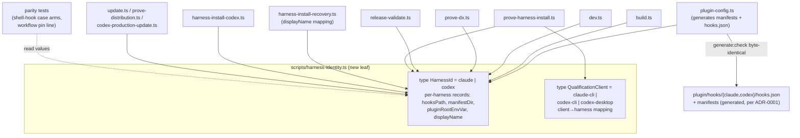
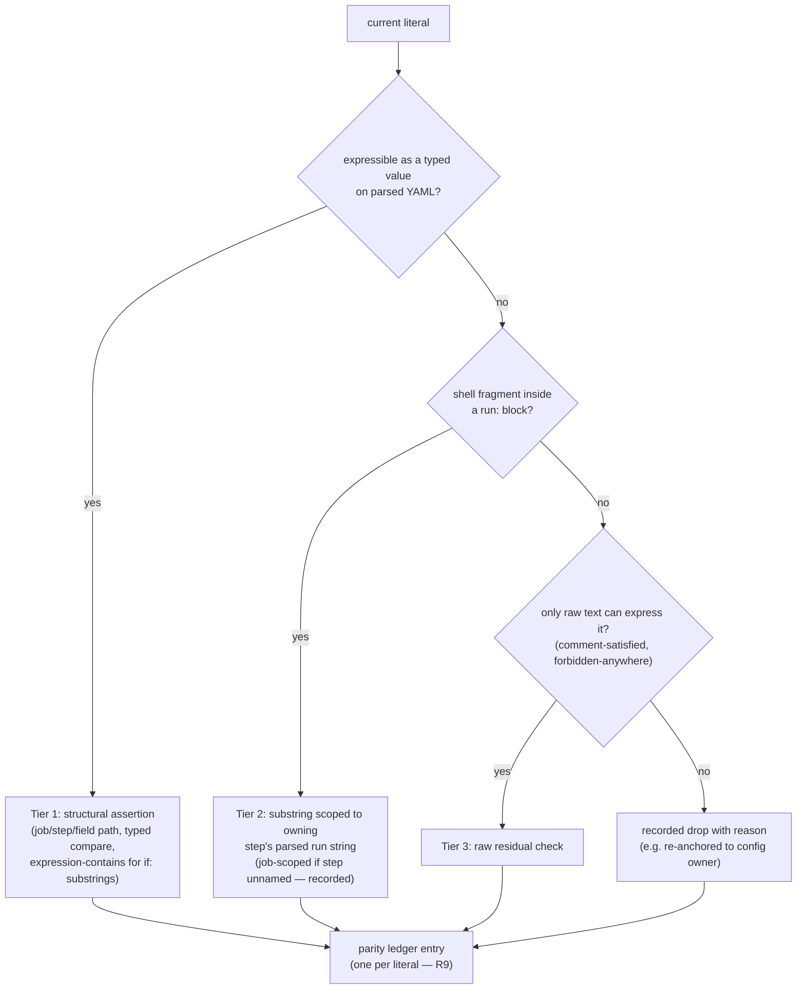

# Harness Identity and Parsed Release Validation - Plan

## Goal Capsule

- **Objective:** Two behavior-preserving refactors of the `scripts/` layer: (1) a new `scripts/harness-identity.ts` leaf module that becomes the single source of harness vocabulary, paths, and driver seams, with all TypeScript branch sites migrated to it; (2) `scripts/release-validate.ts` workflow checks converted from literal substring greps to `Bun.YAML.parse` structural assertions under a strict parity ledger.
- **Authority:** This plan's Requirements and KTDs govern scope. ADR-0001 (per-harness manifests and hook declarations) and the persisted proof/receipt contracts are hard constraints — no unit may violate them.
- **Execution profile:** Two independent PRs. PR 1 = Work 2 (release validation, U1–U4). PR 2 = Work 1 (harness identity, U5–U11), rebased onto PR 1 (only overlap: `scripts/release-validate.ts:526` hooks-path guard). U11 (driver extraction) is droppable to follow-up without unwinding anything.
- **Stop conditions:** Stop and surface if: a parity-ledger literal cannot be classified into a tier without changing what the validator guarantees; generated `plugin/` bytes change under `generate:check`; any persisted JSON or receipt-filename contract would change; or an asserted error message must change to proceed.
- **Tail ownership:** Executor owns branch/PR mechanics per repo conventions (PRs from the myagentdojo account; hosted-canary approval expected per PR since both touch `scripts/`).

---

## Product Contract

### Summary

Create `scripts/harness-identity.ts` as the one owner of harness identity knowledge and migrate all TypeScript branch sites to it, adding validation-only parity checks for the shell hook and workflow surfaces that cannot import it. Separately, rewrite `scripts/release-validate.ts`'s release-workflow checks to navigate parsed YAML structure instead of grepping raw text, holding strict parity via a three-tier ledger.

### Problem Frame

An architecture review (re-verified 2026-08-14 at f06ad99) found harness knowledge re-derived at ~70 sites across 12 script files with three competing vocabularies, and the gap widening — `scripts/codex-production-update.ts` added 13 more branch sites since the review. The same hooks-path pair is written four independent times. Separately, `release-validate.ts` asserts 58 literal substrings against `.github/workflows/release.yml`: whitespace changes break it while policy is intact, and a semantically broken workflow containing the substring passes. The repo already demonstrates the remedy for both: `scripts/prove-harness-install.ts:1370` derives hooks paths from one vocabulary, and `scripts/repository-readiness.ts:733` parses workflows with `Bun.YAML.parse`, fail-closed.

### Key Decisions

- **Work architecture candidates 1 and 2; defer the rest** (session-settled: user-directed — chosen over candidates 3–5 and the standalone test findings from the same review: highest leverage, and candidate 1 is the only module already named in the glossary with no code). Governs R1–R12.
- **Full migration of all TypeScript branch sites** (session-settled: user-directed — chosen over adapter-plus-partial-migration: the gap measurably widened while two patterns coexisted). Governs R2, R3.
- **Validation-only parity for non-TypeScript surfaces** (session-settled: user-directed — chosen over code generation: kills silent drift at a fraction of generation's cost; the hook entrypoint is POSIX shell and can never import TypeScript). Governs R5.
- **Strict parity for release checks** (session-settled: user-directed — chosen over semantic restatement: mechanism change and policy change must not share a diff; these checks guard the release path). Governs R8, R9.
- **Persisted contracts are frozen** (session-settled: user-directed — chosen over migrating the `-cli` proof/receipt vocabulary to canonical IDs: rewriting persisted formats turns a refactor into a data migration with external blast radius). Governs R4.

### Requirements

**Harness identity (Work 1)**

- R1. A single module owns harness identity: canonical IDs, display names, per-harness paths (hooks declaration, manifest directory), the plugin-root env-var mapping, and the qualification-client vocabulary.
- R2. Every TypeScript branch site that discriminates on harness identity reads from that module; no script defines its own harness union, path template, or display mapping.
- R3. Behavior is preserved: generated `plugin/` output is byte-identical, all asserted error messages are byte-identical, and every persisted JSON shape is unchanged.
- R4. The qualification-client vocabulary (`claude-cli`, `codex-cli`, `codex-desktop`) is modelled as a distinct type mapped from canonical IDs; its persisted surfaces (proof JSON `client` fields, receipt filename convention) are unchanged. `codex-desktop` gains no code path — it exists as a vocabulary value only.
- R5. The shell hook (`plugin/hooks/native-capability-hook` case arms) and the pinned CLI-install line shared by `plugin-ci.yml`, `hosted-canary.yml`, and `release.yml` are covered by parity tests that fail when they diverge from the module's values.
- R6. `CONTEXT.md` gains a glossary entry for the new term; a new ADR records the vocabulary decision and the driver-seam shape; `docs/agents/doc-targets.yml` gains rows binding both docs to their verifying artifacts.
- R7. The Claude install driver is extracted behind a dependency-injection interface following the same pattern as `CodexDriverDependencies` (same lifecycle shape; harness-typed state payloads; not the same method surface).

**Release validation (Work 2)**

- R8. Workflow assertions in `release-validate.ts` navigate parsed YAML structure: job existence and order, step navigation, `env`/`permissions`/`concurrency`/`uses`/`needs` asserted as typed values, action pins asserted by walking `jobs.*.steps[].uses`.
- R9. Every current literal is accounted for in a parity ledger with a tier and comparison mode: structural, step-scoped run substring, raw residual (comment-satisfied and forbidden-anywhere checks), or recorded drop with reason. No literal silently disappears.
- R10. Unparseable `release.yml` fails closed: exit 1 with a clear message (new coverage — no test exercises this today).
- R11. Behavior is preserved for consumers: exit codes, stderr messages asserted by `scripts/release-validate.test.ts`, and the `--repair` surface are unchanged.

**Cross-cutting**

- R12. The full suite passes after every implementation unit; `generate:check` stays clean throughout.

### Scope Boundaries

- The generated Plugin Payload does not change. Each Harness keeps its own manifest and hook declarations per ADR-0001 — this work centralizes the derivation of the two distinct paths, never the paths themselves.
- Prose mentions of "Claude"/"Codex" in error messages and help text do not migrate; only branch discriminators, type unions, and mapping call sites do. A "no orphan union" parity rule applies to discriminators only.
- `scripts/ship-canary.ts` and `scripts/repository-readiness.ts` contain no harness-vocabulary branch sites and are untouched.

#### Deferred to Follow-Up Work

- Architecture candidates 3 (subprocess seam), 4 (candidate lineage), 5 (prove-* shape) and the review's three standalone test findings.
- Generating the shell hook / workflow harness fragments from the module (upgrade path if validation-only parity ever proves insufficient).
- Consolidating the six existing hardcoded pin-version assertions in `release-validate.test.ts` and `ship-canary.test.ts` into the new version-agnostic parity test.

---

## Planning Contract

### Key Technical Decisions

- KTD1. **Canonical harness ID is lowercase `"claude" | "codex"`** (session-settled: user-directed — chosen over the `-cli` and capitalized vocabularies: lowercase already keys real filesystem layout and is the dominant form). The capitalized form survives only as a display mapping (it is part of `HarnessInstallRecoveryError`'s asserted message contract); `dev.ts`'s local `type Harness` is deleted in favor of the module's type.
- KTD2. **The registry is two explicit per-harness records, never derivation templates.** The env-var mapping is asymmetric (`claude → CLAUDE_PLUGIN_ROOT`, `codex → PLUGIN_ROOT`, not `CODEX_PLUGIN_ROOT`); a `toUpperCase()` template would silently change generated bytes. Qualification clients are a separate three-value type with a client→harness mapping, because `codex` maps to two clients — it cannot be a per-harness field.
- KTD3. **`harness-identity.ts` is a leaf module**: it imports no sibling scripts. `plugin-config.ts → harness-identity` is the safe direction; the reverse is forbidden. It must never import the six side-effectful entry scripts (`generate.ts`, `package.ts`, `init.ts`, `prove-distribution.ts`, `prove-dx.ts`, `prove-runtime-custody.ts`).
- KTD4. **Expected values come from canonical owners, not re-encoded literals.** Parity tests and structural assertions read from `harness-identity.ts` / `plugin-config.ts` values wherever an owner exists; re-encoding expected values as fresh literals would swap string drift for constant drift. The workflow pin-line parity test asserts the three workflows agree with each other byte-for-byte without knowing the version, so routine CLI bumps do not touch the module.
- KTD5. **Three-tier parity ledger for Work 2** (session-settled: user-approved — step-scoped leaf checks chosen over whole-file greps and over attempting to parse shell). Tiers: (1) structural — typed-value assertions on parsed YAML, including boolean coercion (`overwrite: true` parses as boolean) and expression-contains semantics where a literal is a substring of a larger `if:` expression; (2) step-scoped run substrings — shell fragments checked inside their owning step's parsed `run` string (block scalars strip indentation, so checks target parsed values, not raw slices); where the owning step is unnamed, scope to the job's concatenated run strings and record the weaker scope in the ledger; (3) raw residual — checks only raw text can express: the comment-satisfied `skip-github-release` literal (re-anchor to the existing `release-please-config.json` check at `release-validate.ts:569` and record the comment literal as a drop) and the forbidden-anywhere negatives (`parent_count`, `mergeMode`, `github.run_attempt`), which must scan comments too. The ledger lives in code next to the assertions, one entry per current literal: tier, owner (job/step/field path), comparison mode, or drop reason.
- KTD6. **Job order via `Object.keys` insertion order; fail-closed parse.** Bun.YAML (bun 1.3.14) preserves key insertion order and parses `on:` as the string key `"on"`. Unparseable YAML exits 1 with a message (adapted from `repository-readiness.ts:733-741`'s fail-closed shape, which returns a classification — the validator must exit instead).
- KTD7. **Error messages byte-identical.** `release-validate.test.ts` asserts stderr substrings and mutation tests depend on exact messages; Work 1's migration likewise preserves every thrown message. Cheapest honest behavior-preservation proof.
- KTD8. **Mutation anchors guarded.** Each mutation helper in `release-validate.test.ts` asserts `mutated !== original` before writing, so structural validation cannot silently turn mutation tests into no-ops.
- KTD9. **Claude driver gets a Claude-specific DI interface** (session-settled: user-directed — extraction chosen over leaving the inlined driver, as a droppable final unit). Same DI pattern as `CodexDriverDependencies`, not the same shape: the Claude driver's surface differs (three-scope loop, `findClaudeInstall`/`replaceClaudeInstall`/`claudeEnvironment` shared with `proveHostedHarnessInstall`). Shared lifecycle shape (preflight → capture → mutate → verify → restore-on-failure) with harness-typed state payloads, never a unioned common struct — the new ADR states this constraint natively and cross-references ADR-0001 and ADR-0003. Existing type-only back-import pattern is preserved or improved by moving shared install-state types to a neutral module; the 12 named exports `prove-harness-install.test.ts` imports stay stable.
- KTD10. **Two PRs, Work 2 first** (session-settled: user-directed — chosen over one combined PR: Work 2 is self-contained and carries the heaviest `release-validate.ts` churn; Work 1 rebases onto it touching only the hooks-path guard at `:526`).
- KTD11. **Trust-but-verify the suite** (session-settled: user-approved — chosen over a characterization-test layer: the suite is 596 tests at 1.57× test:source). During implementation, the four hooks-path assertion sites get a deliberate mutation check — change the derived path, confirm a test fails — before the suite is trusted over them. A Test Design Brief precedes every test-artifact change.

### High-Level Technical Design

Module topology after Work 1 — `harness-identity` is a leaf; arrows point from consumer to owner:

Work 2 — tier routing for each of the ~58 current literals:

### Assumptions

- Hosted-canary environment approval is granted per PR (both touch `scripts/`, which `ship-canary.ts:100` classifies as publishing-system).
- Bun stays at the pinned 1.3.14 behavior for YAML key order; U1's ledger work re-verifies before relying on it.

---

## Implementation Units

Unit index:

| U-ID | Title | Key files | Depends on |
|---|---|---|---|
| U1 | Parity ledger + fail-closed test | `scripts/release-validate.ts`, `scripts/release-validate.test.ts` | — |
| U2 | Structural navigation core | `scripts/release-validate.ts` | U1 |
| U3 | Migrate assertions to tiers | `scripts/release-validate.ts` | U2 |
| U4 | Mutation-anchor guards | `scripts/release-validate.test.ts` | U3 |
| U5 | `harness-identity.ts` module | `scripts/harness-identity.ts` (+test) | — |
| U6 | Migrate generators | `scripts/plugin-config.ts` | U5 |
| U7 | Migrate validators + proofs | `build.ts`, `prove-dx.ts`, `release-validate.ts`, `prove-harness-install.ts`, `dev.ts`, `update.ts`, `prove-distribution.ts` | U5, U6, U3 |
| U8 | Display vocabulary migration | `harness-install-recovery.ts`, `harness-install-codex.ts`, `codex-production-update.ts` | U5 |
| U9 | Non-TS parity tests | `native-capability-hook.test.ts`, new workflow-pin test | U5 |
| U10 | Glossary + ADR + doc-targets | `CONTEXT.md`, `docs/adr/0009-*.md`, `docs/agents/doc-targets.yml` | U5 |
| U11 | Claude driver extraction (droppable) | `prove-harness-install.ts`, new shared-types module | U5, U7 |

### Phase 1 — Release validation (PR 1)

### U1. Parity ledger and fail-closed coverage

- **Goal:** Classify every current workflow literal into a ledger entry before any assertion changes, and pin the unparseable-YAML behavior.
- **Requirements:** R9, R10.
- **Dependencies:** none.
- **Files:** `scripts/release-validate.ts` (read), `scripts/release-validate.test.ts`.
- **Approach:**
  1. Enumerate the ~58 whole-file literals (`release-validate.ts:609-668`), the negatives (`:671-681`), the job-scoped checks (`:692-735`), and the action-pin regex (`:600-607`).
  2. Classify each per KTD5's tier flow; resolve the known blocker-shaped entries: `skip-github-release` (comment-satisfied → re-anchor + drop), `ref: ${{ needs.resolve.outputs.candidate_sha }}` (quantifier: name the owning job/step; record the strengthening), `github.event.repository.private == false` (expression-contains), permissions block (deep equality; record dropped adjacency-to-`steps:`).
  3. Add the fail-closed test: corrupt `release.yml` in a repo copy, assert exit 1 and message.
- **Execution note:** Ledger before code — the ledger is the review artifact for R9. The fail-closed test lands red-first against current behavior if current behavior differs.
- **Test scenarios:**
  - Unparseable `release.yml` → exit 1, stderr names the parse failure (new coverage).
  - Ledger completeness: a test iterates the ledger and asserts every entry names a tier and owner or a drop reason; count equals the enumerated literal count.
- **Verification:** Suite green; ledger reviewed as part of the PR.

### U2. Structural navigation core

- **Goal:** Parse `release.yml` once and provide job/step navigation the assertions use.
- **Requirements:** R8, R10.
- **Dependencies:** U1.
- **Files:** `scripts/release-validate.ts`.
- **Approach:** `Bun.YAML.parse` at the current read site (`:507`); helpers to fetch a job, a step by name (or job-scoped run concatenation for unnamed steps), and to walk `jobs.*.steps[].uses`. Job order from `Object.keys`. Fail-closed per KTD6. Keep raw text available for tier-3 checks.
- **Patterns to follow:** `repository-readiness.ts:728-751` (parse + fail-closed shape); `release-validate.test.ts:324` already parses the same file in tests.
- **Test scenarios:**
  - Job-order violation (maintain before compatibility in a mutated copy) → exit 1 with the existing "job boundary"-class message.
  - Unpinned action ref anywhere in any job → exit 1 (walk replaces the regex).
- **Verification:** Suite green; no assertion behavior changed yet.

### U3. Migrate assertions to the three tiers

- **Goal:** Replace the literal loops and string-index job slicing with ledger-backed tiered assertions.
- **Requirements:** R8, R9, R11.
- **Dependencies:** U2.
- **Files:** `scripts/release-validate.ts`.
- **Approach:** Implement each ledger entry in its tier; error messages byte-identical per KTD7; typed comparisons per KTD5 (boolean coercion, expression-contains); tier-3 residuals stay raw-text and scan comments. Delete the slicing code (`:683-691`, `:709-718`) once its assertions are re-homed.
- **Test scenarios (extend existing suite; Test Design Brief first per KTD11):**
  - Every existing positive assertion in `release-validate.test.ts:322-533` still passes against the real `release.yml`.
  - Every existing mutation test (`:1043-1099`) still produces exit 1 with its asserted stderr substring.
  - Reformat-only mutation (reindent a job without semantic change) → validator passes (the brittleness this work removes; new test).
  - A required run-fragment moved to a *different* step → exit 1 (step scoping works; new test).
- **Verification:** Suite green; `bun run release:validate` exits 0 on the real repo; ledger has no unimplemented entries.

### U4. Mutation-anchor guards

- **Goal:** Make `release-validate.test.ts`'s mutation helpers fail loudly when their anchors stop matching.
- **Requirements:** R11, R12.
- **Dependencies:** U3.
- **Files:** `scripts/release-validate.test.ts`.
- **Approach:** Each string-replace mutation asserts `mutated !== original` before writing (KTD8).
- **Test scenarios:** Covered by the change itself — an anchor that no longer matches turns the test red with a clear message instead of silently passing the unmutated file.
- **Verification:** Suite green; deliberately breaking one anchor locally shows the guard firing.

### Phase 2 — Harness identity (PR 2)

### U5. The `harness-identity.ts` module

- **Goal:** Create the leaf module owning harness identity.
- **Requirements:** R1, R4.
- **Dependencies:** none (Phase 2 start; rebased onto Phase 1).
- **Files:** `scripts/harness-identity.ts`, `scripts/harness-identity.test.ts`.
- **Approach:** Two explicit per-harness records per KTD2 (`hooksDeclarationPath`, `manifestDirectory`, `pluginRootEnvVar`, `displayName`); `type HarnessId` derived from the record keys; separate `QualificationClient` type with client→harness mapping; `codex-desktop` is a value with no other code path (R4). JSDoc with `@example` per `plugin-config.ts` house style; tabs, no semicolons, `as const`.
- **Patterns to follow:** `plugin-config.ts` export shape (interfaces + frozen consts + documented functions); leaf-module rule KTD3.
- **Test scenarios:**
  - Record values byte-match the four knowledge points: hooks paths, manifest dirs, env vars (asserting the asymmetry: `PLUGIN_ROOT`, not `CODEX_PLUGIN_ROOT`), display names.
  - Client→harness mapping: `claude-cli→claude`, `codex-cli→codex`, `codex-desktop→codex`; exhaustiveness over both types.
- **Verification:** Suite green; module imports nothing from siblings (checked by review; no import lines).

### U6. Migrate the generators

- **Goal:** `plugin-config.ts` derives manifests and hook declarations from the module.
- **Requirements:** R2, R3.
- **Dependencies:** U5.
- **Files:** `scripts/plugin-config.ts`.
- **Approach:** `hookDeclarationBody`/`hookDeclaration` (`:443-460`) take `HarnessId` and read env var + path from the records; manifest `hooks:` fields (`:404`, `:436`) derive instead of hardcoding. Generated bytes must not change.
- **Execution note:** Run the deliberate mutation check from KTD11 here: alter a record value, confirm `generate:check` and `native-capability-surface.test.ts` fail, revert.
- **Test scenarios:**
  - `generate:check` clean after migration (byte-identical output).
  - `native-capability-surface.test.ts` exact-equality assertions unchanged and passing.
- **Verification:** Suite green; `git diff --exit-code -- plugin/` clean.

### U7. Migrate validators and proofs

- **Goal:** All remaining lowercase branch sites read the module.
- **Requirements:** R2, R3.
- **Dependencies:** U5, U6; U3 (rebase overlap at `release-validate.ts:526`).
- **Files:** `scripts/build.ts` (`:1766` ternary), `scripts/prove-dx.ts` (`:9`, `:28-31`, `:43-51`), `scripts/release-validate.ts` (`:526-531`), `scripts/prove-harness-install.ts` (unions at `:249`, `:283`, `:1358`; derivations at `:1368-1373`; executables map), `scripts/dev.ts` (delete local `type Harness`, `:59`), `scripts/update.ts` (`:199`), `scripts/prove-distribution.ts` (`:247`, `:253`).
- **Approach:** Site-by-site replacement with module reads; discriminators only, prose messages untouched (Scope Boundaries). The four duplicated hooks-path sites collapse to record reads; the `-cli` journey vocabulary at `prove-harness-install.ts:468/:1556/:1807/:1814` types against `QualificationClient` but keeps its journey-fixture launcher mapping at the call site.
- **Execution note:** Deliberate mutation check on the four hooks-path assertion sites (KTD11) before trusting the suite.
- **Test scenarios:**
  - Existing per-file tests pass unchanged (message parity per KTD7).
  - Grep-style orphan check: no remaining `"claude" | "codex"` union declarations outside `harness-identity.ts` (discriminators only).
- **Verification:** Suite green after each file's migration (commit-sized steps).

### U8. Display vocabulary migration

- **Goal:** Delete the capitalized vocabulary as a standalone type; derive display names from the module.
- **Requirements:** R2, R3.
- **Dependencies:** U5.
- **Files:** `scripts/harness-install-recovery.ts` (`:61-95`), `scripts/prove-harness-install.ts` (`:916`), `scripts/harness-install-codex.ts` (`:122`), `scripts/codex-production-update.ts` (`harness: "codex"` field sites `:191`, `:1267`, `:1386`, `:1462`).
- **Approach:** `HarnessRecoveryAdapter.harness` becomes `HarnessId`; interpolated messages use `displayName` — every thrown message byte-identical (`harness-install-recovery.test.ts:78` asserts them). `codex-production-update`'s lowercase `harness` field types against `HarnessId` (resolves the two-casings collision hazard with its import from `harness-install-recovery`).
- **Test scenarios:**
  - `harness-install-recovery.test.ts` passes unchanged — asserted messages still contain "Claude"/"Codex" capitalized.
  - Codex production-update envelope JSON unchanged (`harness: "codex"` persists lowercase).
- **Verification:** Suite green.

### U9. Non-TypeScript parity tests

- **Goal:** The shell hook and workflow pin line cannot silently drift from the module.
- **Requirements:** R5.
- **Dependencies:** U5.
- **Files:** `scripts/native-capability-hook.test.ts` (extend), new `scripts/workflow-pin-parity.test.ts` (or sibling location per Test Design Brief).
- **Approach:** Hook test reads `plugin/hooks/native-capability-hook` and asserts its `SessionStart:`/`Stop:` case arms cover exactly the module's harness IDs. Pin-line test extracts the `bun add --global` line from `plugin-ci.yml`, `hosted-canary.yml`, `release.yml` and asserts all three are byte-identical — version-agnostic per KTD4.
- **Test scenarios:**
  - Case-arm drift (add/remove/rename an ID in a repo copy) → test fails.
  - One workflow's pin line differing from the others → test fails; bumping all three together → passes.
- **Verification:** Suite green.

### U10. Glossary, ADR, doc-targets

- **Goal:** The vocabulary decision and the new term are durable and drift-guarded.
- **Requirements:** R6.
- **Dependencies:** U5 (definition crystallised from the real module).
- **Files:** `CONTEXT.md`, `docs/adr/0009-canonical-harness-identity.md`, `docs/agents/doc-targets.yml`.
- **Approach:** Glossary entry in house format (`**Term**:` + definition + `_Avoid_:` line) naming the module's term; ADR 0009 in ADR-0008's sectioned form (Status/Context/Decision) records: canonical lowercase IDs, the frozen `-cli` qualification-client contract with `codex-desktop`, the display mapping, and the driver-seam constraint stated natively (KTD9) with cross-references to ADR-0001 and ADR-0003. doc-targets.yml rows bind both to `scripts/harness-identity.ts`.
- **Test scenarios:** Test expectation: none — documentation unit; drift coverage comes from the doc-targets rows and existing docs-drift tooling.
- **Verification:** `doc-targets.yml` parses; docs-drift check (if run) passes.

### U11. Claude driver extraction (droppable)

- **Goal:** Claude's inlined driver (`prove-harness-install.ts:845-1016`) sits behind a Claude-specific DI interface.
- **Requirements:** R7, R3.
- **Dependencies:** U5, U7.
- **Files:** `scripts/prove-harness-install.ts`, `scripts/harness-install-claude.ts` (new), shared install-state types module if needed to avoid deepening the existing type-only cycle with `harness-install-codex.ts`.
- **Approach:** Per KTD9 — same DI pattern as `CodexDriverDependencies`, Claude-shaped surface (three-scope loop; `findClaudeInstall`/`replaceClaudeInstall`/`claudeEnvironment` also serve `proveHostedHarnessInstall:1175-1198`, so extraction must serve both callers). The 12 named exports `prove-harness-install.test.ts` imports remain stable. Scope preservation semantics (user/project/local, `--keep-data`, `defaultEnabled: false`) unchanged.
- **Execution note:** This unit is droppable to follow-up at implementation time without unwinding U5–U10. If dropped, record it under Deferred to Follow-Up Work in the PR description.
- **Test scenarios:**
  - `prove-harness-install.test.ts` passes unchanged (export surface stable).
  - Injected-failure recovery paths for Claude behave identically (existing recovery tests).
- **Verification:** Suite green; `bun run prove:harness-install` unchanged behavior locally where runnable.

---

## Verification Contract

| Gate | Command / mechanism | Applies to |
|---|---|---|
| Unit + integration suite | Bun tests via the repo's MCP runner (never raw `bun test`) | every unit (R12) |
| Generated-output drift | `bun run generate:check`; `git diff --exit-code -- plugin/` | U5–U8 |
| Release validation self-check | `bun run release:validate` exits 0 on the real repo | U1–U4, U7 |
| Full proof chain | `bun run prove:all` before each PR | both PRs |
| Deliberate mutation checks | KTD11: break a derived value, observe a failure, revert | U6, U7 |
| Test Design Brief | `test-design` skill before any test-artifact change | U1, U3, U4, U5, U9 |
| Docs drift | doc-targets.yml rows verified by the docs-drift tooling | U10 |

## Definition of Done

- All units complete, or U11 consciously dropped and recorded as deferred.
- Parity ledger covers every enumerated literal with a tier or recorded drop; no unclassified entries (R9).
- Suite green, `generate:check` clean, `release:validate` exit 0, `prove:all` green at each PR head.
- Generated `plugin/` output, persisted JSON contracts, and asserted error messages byte-identical throughout (R3, R4, R11).
- Glossary entry, ADR 0009, and doc-targets rows landed (R6).
- No abandoned or experimental code in either diff; both PRs opened from the myagentdojo account with hosted-canary qualification.
