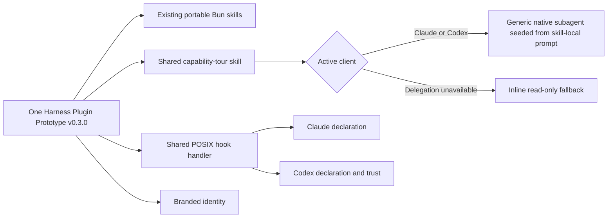
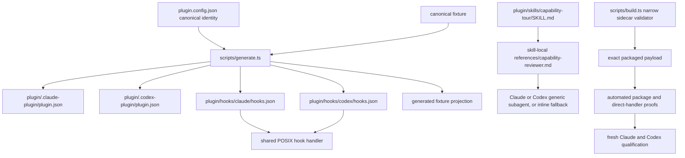

# Native Plugin Capability Tour Plan

## Goal Capsule

- **Objective:** Release Harness Plugin Prototype v0.3.0 as one branded, candidate-bound capability tour for Claude and Codex.
- **Baseline:** v0.2.0 at `db4d5fff2ecd6140ad1788d6bfb9e7eff504e3ba`; revalidate current main before implementation and record any assumption changes.
- **Product authority:** This project owns the v0.3.0 capability experience. [Single Bun Runtime Custody](../../single-bun-runtime-custody/README.md) remains authoritative for runtime installation and repair.
- **Actors and outcome:** A plugin author or evaluator installs/enables the plugin, decides hook trust, and runs the tour to determine which portable plugin capabilities actually work in the active client. The native client discovers components; the shared skill orchestrates the tour; a bounded reviewer or inline fallback verifies read-only facts; the agent responds to any Stop continuation.
- **Open blockers:** None at product scope. Codex trust and fresh-client activation remain human-operated qualification boundaries.
- **Tail ownership:** Repository tests own deterministic package and handler contracts. Candidate-bound fresh-client receipts own native activation, UI identity, and delegation claims.

## Product Contract

### Summary

Turn the existing portable-skill prototype into a coherent tour of useful native plugin capabilities without creating a showroom framework.
The same installed plugin retains `hello-world`, the ESM `skill-a`, the CJS `skill-b`, and the model-only `runtime-custody` skill; adds one model-only `capability-tour` skill; demonstrates truthful client-specific delegation; gains recognizable identity; and includes a dependency-free lifecycle-hook proof.

### Problem Frame

Harness Plugin Prototype v0.2.0 proves dependency-closed skill execution and agent-approved Bun custody, but its installed surface looks generic and does not demonstrate hooks or agent-style decomposition.
A hook-only v0.3.0 would prove mechanics yet still leave the plugin feeling fragmented.

The useful whole is one guided experience: identify the installed plugin, inspect what it packaged, run a bounded independent check, distinguish native from direct evidence, and show lifecycle behavior.
The design must remain honest where Claude and Codex differ and must not add components merely to fill a capability checklist.

### Key Decisions

- **Make v0.3.0 one capability tour.** (session-settled: user-directed — chosen over a hook-only increment after the user requested the fullest cohesive feature that fits one plugin.) Governs R1, R18-R27.
- **Extend the same plugin.** (session-settled: user-directed — chosen over another installed proof plugin: one stable identity and release lineage.) Governs R1, R18-R20.
- **Use one shared skill with agentless delegation.** (session-settled: user-approved — chosen after inspecting Compound Engineering 3.21.4: a skill-local prompt seeds each host's generic subagent, avoiding a Claude-only agent and Codex companion install.) Governs R21-R26.
- **Keep MCP out of v0.3.0.** (session-settled: user-approved — chosen over a no-op server: MCP would add startup/runtime/network ownership without a real service use case.) Governs R28.
- **Prove lifecycle behavior, not runtime setup.** (session-settled: user-approved — chosen over Bun prewarm or repair hooks: runtime custody already has an agent-native approval flow.) Governs R2, R11.
- **Use a plugin-owned drift fixture.** (session-settled: user-directed — chosen over executing workspace checks: automatic hooks must not run user project code.) Governs R5, R6, R13.
- **Show success once at session start.** (session-settled: user-directed — chosen over silent or repeated receipts: visible proof without recurring noise.) Governs R3, R4.

### Requirements

#### One plugin and recognizable identity

- R1. Ship all v0.3.0 additions inside the existing `harness-native-plugin-prototype` payload and preserve its stable plugin ID.
- R18. Keep one consistent display name, short description, long description, capability list, and starter prompt across generated native manifests and marketplaces. The canonical starter prompt is `Run the native plugin capability tour.`
- R19. Supply one restrained brand color plus an identity-neutral composer icon and logo through Codex's documented interface metadata. The checked-in assets must remain valid when the template is initialized under another plugin name; Claude metadata must remain coherent without claiming unsupported icon behavior.
- R20. Preserve all v0.2.0 skills, Bun bundles, runtime-custody behavior, and direct launchers without adding a setup prerequisite.

#### Lifecycle hooks

- R2. Limit hooks to `SessionStart` and `Stop`; neither event may install, repair, prewarm, or select Bun.
- R3. On `SessionStart` source `startup` or `resume`, emit `Harness Plugin Prototype v{version} | {client} | SessionStart:{source}` with no private path, session identifier, content, or environment value.
- R4. A successful `Stop` validation must emit no stdout or stderr and must not create a user-visible success message.
- R5. `Stop` must compare one plugin-owned canonical fixture with one deterministic generated projection through a read-only dependency-free path. Generation must use fixed literal content, fixed field order, and LF line endings; runtime must set `LC_ALL=C` and compare exact shipped bytes without enumeration or regeneration.
- R6. Hooks must not execute package scripts, binaries, configuration, or any other code owned by the current workspace.
- R7. Only a proven byte mismatch may return the common structured `decision: block` response. Its canonical reason is: `Harness Plugin Prototype v{version} found a mismatch in its packaged lifecycle proof files. Do not modify the workspace. Continue once to explain how to reinstall this plugin from its trusted source; if the mismatch remains, report this plugin version.`
- R8. If top-level `stop_hook_active` is exactly `true`, this plugin must exit successfully and silently before comparison, so it requests at most one continuation for a Stop attempt. Because the flag reflects any Stop hook's continuation, drift qualification must run without another blocking Stop hook and absence of this plugin's drift receipt must not be interpreted as handler failure.
- R9. Hook execution must never rewrite, regenerate, delete, or chmod the fixture, plugin payload, workspace, or user state.
- R10. Every plugin skill must remain directly usable when hooks are disabled, untrusted, rejected, or unsupported.
- R11. Hook execution must require no Bun, Node, Python, jq, git, network access, background service, persistent log, or plugin-owned setup/bootstrap command. Codex's client-native exact-definition trust remains an explicit user-controlled activation step.
- R12. The tour may report `currentSessionHook` as `observed` only from the current session's native context marker; otherwise it reports `unknown`. Candidate qualification remains external evidence owned by the release receipt matrix and is never inferred or ingested by the tour.
- R13. User-facing copy must call the fixture a lifecycle mechanics proof, not a production integrity, security, or workspace-quality guarantee.
- R14. Exact-candidate native Claude and Codex proofs must cover trusted activation, the versioned start receipt, normal existing-skill execution, and a silent clean Stop backed by host-owned evidence that the exact installed handler ran with zero stdout and stderr.
- R15. Qualification must prove the shared tour and an existing v0.2.0 skill remain usable with Claude hooks disabled and with Codex hooks disabled or the exact definition untrusted.
- R16. Drift qualification may alter only a candidate-derived disposable copy, must record source candidate SHA and derived payload hash, and must never label the altered copy as the release candidate.
- R17. Evidence must distinguish package declaration, direct handler execution, native hook activation, and native delegation as separate proof layers. A model-authored delivery label is non-authoritative; native delegation requires host-owned subagent lifecycle evidence correlated with the structured reviewer handback.

#### Shared tour and delegation

- R21. Add exactly one model-only `capability-tour` skill as the user-facing diagnostic and guided tour; it must not enter `runtime/skill-catalog.json` or receive a `plugin/bin` launcher.
- R22. The tour's default response must contain four ordered groups: (1) one-line overall verdict and installed identity; (2) an evidence matrix for declaration, direct handler, `currentSessionHook`, external candidate qualification, and delegation delivery; (3) the available portable skills; and (4) a next action only for an untrusted hook, fixture failure, failed delegation, or other non-healthy state. Raw paths, hashes, and handler JSON stay out of the default response.
- R23. The tour must request exactly one bounded read-only verification task from a generic native subagent when the active client supports it, then synthesize the result.
- R24. The reviewer instruction must live as one skill-local prompt asset under `plugin/skills/capability-tour/references/`; it must specify no mutation, no model pin, bounded inputs, and a structured handback.
- R25. Claude and Codex must both report `native-subagent-via-skill` plus the active client only when the reviewer handback satisfies R24 and the native receipt supplies the host-owned evidence required by R17. Neither path may claim a packaged standalone agent or write agent configuration into user/project state.
- R26. The tour must distinguish `native-subagent-via-skill`, `inline-fallback-unavailable`, and `inline-recovery-delegation-failed`. Both inline modes complete the same bounded checks and avoid claiming subagent proof; the failed mode remains visibly non-healthy.
- R27. A tour result must never infer native hook activation from manifest presence or successful direct handler execution.

#### Scope guard

- R28. v0.3.0 must not add standalone plugin agents, MCP, connectors/apps, browser extensions, LSP, monitors, scheduled tasks, output styles/themes, channels, telemetry, screenshots, default settings, user configuration mutation, additional hook events, or a generic component/capability framework.

### Capability Model



### Key Flows

- F1. **Discover one recognizable plugin.** Fresh Claude and Codex installations show one stable plugin identity; Codex displays the documented visual assets and starter prompt. Covers R1, R18-R20.
- F2. **Run the capability tour.** The shared skill reads installed package facts, directly checks the hook sidecar, requests one bounded read-only delegation, and synthesizes a truth-labeled result. Covers R21-R27.
- F3. **Trusted session start.** A supported native client invokes `SessionStart` on startup or resume and receives the concise version/client/event receipt. Covers R2-R3, R11-R14.
- F4. **Clean completion.** `Stop` parses only top-level `stop_hook_active`; when false and fixture bytes match, it exits with no output. Covers R4-R6, R8-R11.
- F5. **Drift continuation.** A disposable derived payload has a mismatched projection; first Stop returns one structured block, re-entry with `stop_hook_active: true` exits silently, and no file is changed. Covers R7-R9, R14, R16.
- F6. **Hooks unavailable.** Claude hooks are disabled or Codex hooks are disabled/untrusted; the capability tour and an existing skill still run, and the tour reports `currentSessionHook: unknown` without making a candidate-qualification claim. Covers R10, R12, R15, R17.
- F7. **Delegation unavailable or failed.** The shared skill performs the same bounded check inline and distinguishes host unavailability from an attempted delegation failure. Covers R23, R25-R27.

### Acceptance Examples

- AE1. **Covers R1, R18-R20.** Given the exact v0.3.0 candidate, when installed fresh in both clients, then one stable plugin identity is discovered and no legacy duplicate proof plugin is required.
- AE2. **Covers R19.** Given fresh Codex discovery, when the plugin card/composer is inspected, then the declared color, icon/logo, and starter prompt resolve from packaged assets; Claude documentation claims only its supported metadata.
- AE3. **Covers R21-R27.** Given the shared tour in Claude, when delegation is available, then one generic native subagent is seeded from the skill-local reviewer prompt and the host-owned receipt plus correlated handback prove `native-subagent-via-skill` with client `claude` and no mutation.
- AE4. **Covers R21-R27.** Given the shared tour in Codex, when delegation is available, then the same prompt seeds one generic native subagent and the host-owned receipt plus correlated handback prove `native-subagent-via-skill` with client `codex`.
- AE5. **Covers R26.** Given delegation is unavailable or an attempted delegation fails, when the tour runs, then equivalent read-only checks complete inline and the report distinguishes `inline-fallback-unavailable` from `inline-recovery-delegation-failed` without claiming agent proof.
- AE6. **Covers R2-R4, R14.** Given a fresh trusted installation, when Claude or Codex starts or resumes and later stops with matching fixture bytes, then one versioned start receipt appears, Stop is silent, and host-owned evidence proves that the exact handler ran with zero output.
- AE7. **Covers R5-R9, R16.** Given a candidate-derived disposable copy with a changed projection, when Stop runs, then one continuation is requested, re-entry is silent, neither fixture is modified by hook execution (both match their pre-Stop bytes), and the receipt identifies the derived payload hash separately from the source candidate.
- AE8. **Covers R10, R12, R15, R17.** Given hooks are disabled or untrusted, when the tour and `hello-world` are invoked, then both remain usable and the report distinguishes declared/direct health from unproved native activation.
- AE9. **Covers R6, R11.** Given a hostile workspace or no workspace metadata, when either hook fires, then no workspace code runs and behavior is unchanged.
- AE10. **Covers R20-R21.** Given generation and build complete, then v0.2.0's `hello-world`, `skill-a`, `skill-b`, and `runtime-custody` skills plus the three Bun launchers remain intact while `capability-tour` has no runtime catalog row, bundle, or launcher.
- AE11. **Covers R28.** Given the packaged inventory, then it contains no standalone agent directory, MCP, user settings, Codex agent TOML, extra hook event, telemetry, or generic capability runner.

### Scope Boundaries

- No Bun installation, repair, prewarm, cache management, or runtime selection from hooks or the model-only tour.
- No workspace formatting, linting, testing, generated-file repair, or command execution from hooks.
- No production integrity/security claim, permission auto-approval, command policy, sandbox, scanner, or persistent audit log.
- No MCP merely to demonstrate MCP; revisit only with a real controlled service/tool use case and its own runtime/auth plan.
- No standalone-agent distribution: both clients use their host-native generic subagent primitive seeded from the same skill-local prompt.
- No generic registry, runner, adapter SDK, theme, design system, screenshot suite, or additional standalone plugin.

## Planning Contract

### Key Technical Decisions

- KTD1. Generate separate Claude and Codex hook declaration files around one shared POSIX handler. This follows the repository's explicit native-adapter boundary and permits truthful client/event arguments without duplicating logic.
- KTD2. Invoke the handler by absolute installed-plugin-root path, never session cwd. Claude uses its plugin-root environment; Codex uses its documented plugin-root environment and compatibility variables only where explicitly tested.
- KTD3. Do not embed the plugin version in hook command declarations. Read the single semver from the installed native manifest so a version-only release does not churn Codex's exact hook-definition trust hash.
- KTD4. Validate the complete bounded input as JSON using dependency-free POSIX `awk`, then extract only the top-level `stop_hook_active` boolean needed by the contract. Do not use raw grep or parse string/nested decoys as the target member.
- KTD5. Fail open on malformed/missing input, duplicate or non-boolean guard values, invalid version metadata, missing/unreadable fixture, or unavailable comparison tooling. Emit at most one bounded static warning, never a continuation. On invalid or unreadable version metadata, SessionStart emits the warning instead of R3's receipt and never substitutes a placeholder version. Only a proven byte mismatch blocks.
- KTD6. Keep one canonical fixture source and one deterministic generated projection. Generation occurs in repository tooling; runtime only compares exact bytes.
- KTD7. Keep `capability-tour` model-only. Its package contract is a `SKILL.md` with no runtime catalog entry, bundled JS, launcher, install step, or network dependency.
- KTD8. Follow Compound Engineering's current agentless distribution pattern: keep one reviewer prompt in the skill, dispatch a generic native subagent through the host primitive, and fall back inline. Do not create an `agents/` package surface or companion installer.
- KTD9. Bind automated proofs to bytes and candidate identity, but reserve native activation, UI presentation, trust, and delegation claims for fresh-client qualification receipts.
- KTD10. Add exact allowlists for the sidecar surfaces instead of weakening the existing Bun-only closure checks globally.

### High-Level Technical Design

All paths below are relative to `agent-plugin-template` unless noted.
Exact leaf filenames may change during implementation if all one-owner and inventory invariants remain intact.



### Implementation Constraints

- Preserve unrelated worktree state and begin from current remote main, not a stale local main.
- Preserve `runtime/skill-catalog.json` as the closed owner of Bun-backed skills and `plugin/bin` as its launcher projection.
- Use `/bin/sh` plus required POSIX tools under a system-only `PATH`; do not depend on the user's shell initialization.
- Treat `SessionStart` sources other than startup/resume as silent; omission or future values must not create repeated receipts.
- The Stop guard must inspect the top-level JSON key, resist string/nested decoys, and read at most 1 MiB plus one overflow byte. Overflow fails open with the bounded warning; no unbounded buffering or input evaluation is permitted.
- Do not place a version literal in static hooks, reviewer prompts, assets, or the capability skill unless it is a generated projection with one canonical owner.
- Static hooks, skills, reviewer prompt assets, and brand assets remain outside Release Please's version-only projection; add tests that lock this ownership boundary.
- Asset bytes must be deterministic, identity-neutral for downstream template initialization, packaged, referenced by relative manifest paths, and small enough for normal plugin distribution.
- `prove-harness-install` may report declarations/direct health but must retain its explicit statement that it does not prove native activation.
- Native proof receipts go under private XDG state (`0700` directories, `0600` files), with hashes and durable conclusions promoted—not raw sessions.

### Sequencing

1. Build and test the dependency-free hook/fixture seam before exposing it in manifests.
2. Add the model-only tour and reviewer prompt asset, assets, generated declarations, and exact package admission.
3. Extend package/distribution/install/release proofs while preserving the v0.2.0 runtime closure.
4. Qualify one exact candidate in fresh Claude and Codex, using a separately identified derived copy for drift, then update release-facing docs and ADRs from observed behavior.

### System-Wide Impact and Risks

- **Generation:** `plugin.config.json`, `scripts/plugin-config.ts`, and `scripts/generate.ts` gain new projections. Risk is duplicate identity/version ownership; generation checks must prove one canonical owner.
- **Packaging:** `scripts/plugin-files.ts`, `scripts/build.ts`, and package proofs must accept an exact sidecar inventory without weakening executable closure. Risk is accidentally admitting arbitrary model-only skills or commands.
- **Development:** `scripts/dev.ts` must watch hooks, skills (including the reviewer prompt), and assets. Risk is local iteration not reflecting packaged output.
- **Release:** release impact already includes `plugin/**`; projection tests must prove static sidecars are release-relevant without becoming version projections.
- **Trust:** Codex requires exact hook-definition review. A version-only update should not alter definitions; any declaration change must be requalified and documented as trust-affecting.
- **Failure:** hooks fail open for operational uncertainty and block only on proven fixture mismatch. This trades enforcement for loop safety because the feature is a mechanics proof.
- **Compatibility:** qualify macOS and Linux POSIX hosts only unless a separate Windows contract is added. Do not imply native Windows support from `/bin/sh` syntax.
- **Privacy:** receipts contain version/client/event and hashes only; no paths, prompts, session data, transcript text, or environment dumps.

## Implementation Units

### U1 — Dependency-free lifecycle sidecar

**Goal:** Establish the complete hook behavior as a small, independently testable module before native registration.

**Requirements covered:** R2-R9, R11-R13.

**Dependencies:** Current v0.2.0 generation conventions and official Claude/Codex hook contracts.

**Primary files:**

- Add `plugin/hooks/native-capability-hook`.
- Add one canonical fixture source and one generated projection under `plugin/hooks/fixture/`.
- Extend `scripts/generate.ts` or a narrowly owned helper for deterministic projection.
- Add `scripts/native-capability-hook.test.ts` and generation assertions.

**Approach:**

- Implement fixed event/client arguments with JSON on stdin and JSON/no-output on stdout.
- Read version from the installed manifest and require exactly one valid semver.
- Emit SessionStart context only for startup/resume.
- Enforce the 1 MiB input cap before parsing; parse only top-level `stop_hook_active`; true exits silently before comparison.
- Compare exact fixture bytes; mismatch returns one common block envelope; all operational ambiguity fails open with one bounded warning on stderr and empty stdout.

**Test scenarios:** clean Stop silence; first mismatch block; active re-entry silence; startup/resume receipt; clear/compact/fork silence; whitespace/reordered JSON; string and nested decoys; duplicate/missing/non-boolean guard; malformed/oversized input; invalid version; missing/unreadable fixture; unavailable comparison tool; hostile cwd/PATH; no file mutation. Exercise malformed input, oversized input, and operational Stop failures for both Claude and Codex.

**Verification:** Focused Bun tests run the handler in isolated temporary plugin roots and assert stdout, stderr, exit code, byte hashes, filesystem snapshot, and absence of Bun/Node/network/workspace execution.

### U2 — One coherent native plugin surface

**Goal:** Package the tour, agentless delegation, client declarations, and branded identity as exact sidecars around the unchanged portable core.

**Requirements covered:** R1, R18-R28.

**Dependencies:** U1's stable handler/fixture contract.

**Primary files:**

- Update `plugin.config.json`, `scripts/plugin-config.ts`, `scripts/generate.ts`, and generated native manifests/marketplaces.
- Add `plugin/hooks/claude/hooks.json` and `plugin/hooks/codex/hooks.json` as generated declarations.
- Add `plugin/skills/capability-tour/SKILL.md`.
- Add `plugin/skills/capability-tour/references/capability-reviewer.md` as the single cross-client reviewer prompt.
- Add deterministic `plugin/assets/` icon/logo files.
- Update `scripts/build.ts`, `scripts/dev.ts`, and their tests. Reuse the existing recursive `scripts/plugin-files.ts` payload inventory unchanged.
- Update `scripts/init.test.ts` to prove initialized plugins retain valid neutral asset references without Harness-specific visual identity.
- Add focused manifest, sidecar, delegation-prompt, asset, and model-only-skill contract tests, including a negative assertion that no standalone agent surface exists.

**Approach:**

- Keep one identity owner in `plugin.config.json`; project client-specific fields through existing manifest generation.
- Give each client an explicit hook declaration that invokes the same handler with fixed client/event arguments.
- Make the tour inspect only installed plugin facts, render R22's four groups, and seed one generic native subagent from the reviewer prompt, with explicit client and fallback delivery labels.
- Permit only the named model-only skill without a launcher/catalog entry; reject arbitrary executable sidecars.
- Replace blanket no-hooks assertions with an exact capability-sidecar allowlist while retaining Bun closure validation.

**Test scenarios:** exact manifest paths/copy/version; asset existence and package hashes; one reviewer prompt asset; no standalone agent directory or companion install; no model pin/default agent; tour absent from catalog/bin/bundle inventory; declarations unchanged by version-only projection; dev watches new surfaces; no MCP/settings/excess components.

**Verification:** `generate:check`, focused contract tests, build/package inventory comparison, and a generated-diff test proving all generated surfaces are clean.

### U3 — Proof and release admission

**Goal:** Make every automated claim candidate-bound and preserve the full v0.2.0 executable closure while admitting only the intended sidecars.

**Requirements covered:** R10, R12, R14-R17, R20-R22, R27-R28.

**Dependencies:** U1-U2 packaged candidate.

**Primary files:**

- Update `scripts/prove-distribution.ts`, `scripts/prove-dx.ts`, `scripts/prove-harness-install.ts`, `scripts/harness-install-codex.ts`, and focused tests.
- Update `scripts/release-validate.ts`, `scripts/release-projection.test.ts`, `scripts/runtime-custody-generation.test.ts`, and package/checksum tests.
- Update `package.json` proof composition only if a narrow new proof command is necessary.

**Approach:**

- Validate exact hook, fixture, skill, reviewer-prompt, and asset bytes in source, archive, extracted payload, and installed payload.
- Report declaration health, direct handler health, fixture state, and current-session observation separately. Do not ingest release qualification receipts or turn direct execution into a native claim.
- Prove the model-only skill cannot gain a launcher or runtime bundle and that `hello-world`, `skill-a`, `skill-b`, and `runtime-custody` plus the existing three launchers remain intact.
- Keep installed proof honest: no direct invocation may satisfy a native-activation field.
- Bind proof results to candidate commit, archive checksum, payload hash, and installed payload hash.

**Test scenarios:** missing/orphan/extra sidecar; tampered asset/reviewer-prompt/declaration/fixture; stale generated projection; version-only release; tour accidentally catalogued or bundled; hooks disabled/untrusted fallback; existing ESM/CJS/hello-world execution with package-manager dependencies absent from runtime; no Bun host until separately approved repair.

**Verification:** full automated suite, build, package, distribution proof, runtime-custody/platform proof, release validation JSON, and `prove:all` with no weakened v0.2.0 assertions.

### U4 — Fresh native qualification and documentation

**Goal:** Prove the exact v0.3.0 candidate in both clients and publish only claims supported by native receipts.

**Requirements covered:** All requirements, especially R3-R4, R14-R17, R19, R23-R27.

**Dependencies:** U1-U3 green exact candidate and human availability for Codex hook trust and UI/client inspection.

**Primary files:**

- Update repository `README.md`, `CONTEXT.md`, and ADR 0005 language that currently says no lifecycle hooks.
- Add `docs/adr/0008-native-plugin-capability-tour.md` (next available number if changed).
- Extend the existing `prove-harness-install` evidence envelope and `ship-canary` candidate-lineage owner; keep the human-operated private-XDG receipt recipe in the existing qualification documentation rather than creating a second framework.

**Approach:**

- Install the exact candidate into isolated fresh Claude and Codex profiles.
- Claude: prove enabled plugin, skill-seeded native delegation with host-owned lifecycle evidence, native SessionStart, host-observed silent clean Stop, one derived-copy drift continuation, re-entry silence, and disabled-hooks fallback.
- Codex: explicitly trust the exact hook definition through `/hooks`; prove native subagent-via-skill with host-owned lifecycle evidence, the same hook behavior, and disabled/untrusted fallback.
- Inspect one installed identity in each client and Codex's documented asset/prompt presentation.
- Hash the candidate and installed payloads; keep raw receipts private; publish only bounded summary/evidence metadata.

**Test scenarios:** fresh discovery; changed hook definition requires Codex review; plugin enabled with hooks off; delegation unavailable fallback; attempted delegation failure with inline recovery; exact clean candidate; separately hashed derived drift copy; second Stop silent; no other blocking Stop hook during drift proof; no workspace/plugin mutation.

**Verification:** candidate-bound Claude and Codex receipt matrices, installed payload hashes, automated `prove:all`, release validation, repository checks, and final review with no concerning P0/P1/P2.

## Verification Contract

### Automated gate

From the `agent-plugin-template` worktree:

```sh
bun run generate:check
bun test
bun run build
bun run package
bun run prove:distribution
bun run prove:runtime-custody
bun run prove:runtime-platform
bun run release:validate -- --json
bun run prove:all
git diff --check
```

If workflow files change, also run `actionlint .github/workflows/*.yml`.
Focused unit tests are required during development, but they do not replace the full gate.

### Native evidence gate

- Exact source commit, archive checksum, and payload hashes bind one candidate lineage; only the packaged and installed payload hashes must be equal.
- Fresh Claude receipt covers discovery, host-corroborated skill-seeded native delegation, shared tour synthesis, SessionStart, host-observed silent Stop, and hooks-disabled fallback.
- Fresh Codex receipt covers discovery/assets, host-corroborated native subagent-via-skill, explicit exact-definition trust, SessionStart, host-observed silent Stop, and disabled/untrusted fallback.
- Derived drift receipts identify the source candidate plus distinct derived payload hash and prove first block, active re-entry silence, and zero mutation.
- Each result explicitly states whether it proves declaration, direct execution, native activation, delegation, or UI presentation.

### Review threshold

- No open concerning P0, P1, or P2 finding at the exact final head.
- All actionable review threads are resolved with tests or an explicit accepted decision.
- P3 suggestions may remain only when recorded as non-blocking and outside the accepted v0.3.0 scope.
- Hosted checks and final-head qualification must be green; historical runs do not satisfy the gate.

## Definition of Done

- One v0.3.0 plugin retains the complete v0.2.0 portable runtime surface and adds only the approved capability sidecars.
- One shared capability-tour skill works in Claude and Codex with R22's ordered output, host-corroborated delegation labels, and visibly distinct unavailable/failed inline recovery.
- One skill-local reviewer prompt drives generic native delegation in both clients; no standalone agent artifact, companion installer, or user config write exists.
- Codex identity assets and prompt render from packaged files; cross-client copy remains coherent and support claims are precise.
- Hook behavior satisfies the visible-start, silent-clean-stop, proven-drift-only block, one-continuation, fail-open, no-mutation, and no-workspace-execution contracts.
- Disabled/untrusted hooks do not block the tour or existing skills.
- Automated, fresh-native, derived-drift, and UI claims are separated and bound to the exact final candidate.
- Documentation and ADRs describe the resulting behavior, asymmetric client support, trust boundary, and explicit exclusions.
- Full automated gates pass, native receipt matrices pass, hosted final-head checks pass, and no concerning P0/P1/P2 remains.
- No MCP, generic framework, extra plugin, plugin-owned setup/bootstrap command, telemetry, user settings mutation, or unrelated capability enters the release. Codex's user-controlled native hook trust remains required for activation.

## Research Notes

- Claude documents plugin-packaged agents, but this cross-client plan deliberately does not use them because the reviewer is an internal skill step rather than a separately discoverable persona.
- OpenAI's plugin package schema documents skills, hooks, MCP/apps, and interface assets, but not plugin-packaged custom agents.
- Codex custom agents are configured separately in user/project TOML; this plan therefore uses native delegation from the shared skill instead of mutating that configuration.
- Compound Engineering 3.21.4 provides the proven precedent: current skills seed generic subagents from skill-local prompt assets, while its older standalone-agent converter remains a legacy/general conversion path rather than the native CE install contract.
- Both hook contracts share the command-hook stdin model, SessionStart context output, Stop `stop_hook_active`, and structured block response needed for the bounded proof.
- Codex's explicit hook-definition trust makes definition stability and fresh trusted qualification part of the product contract.
