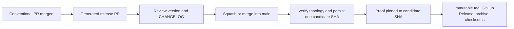

# Publish a release

Use this runbook when merging the generated release PR and publishing its admitted candidate.

Normal PRs merge into `main` without publishing. Each push is classified as release-PR maintenance, publication, or incomplete-publication repair. Release Please only maintains one generated release PR that accumulates releasable commits. Its configuration sets `skip-github-release: true`; it never creates the version tag or GitHub Release.

1. Merge normal PRs with valid Conventional Commit titles.
2. Wait for the `Release` workflow's maintenance path to create or update the release PR. No tag or GitHub Release is created here.
3. Confirm the first release is `v0.1.0`; review the proposed semantic version, exact version projection, and generated `CHANGELOG.md`.
4. Squash-merge the release PR into `main`. A two-parent merge commit is also supported when merge commits are enabled and `main` does not require linear history.
5. Wait for the workflow to admit exactly one merged release PR bound to `github.sha`: base `main`, configured Release Please automation identity, only the allowed version projection, and a verified one-parent or two-parent topology. In both cases the first parent must equal both the trusted pre-merge base and the merged PR's frozen base, and every changed candidate blob must equal the corresponding blob from the reviewed PR head. A two-parent candidate must also bind its second parent to the reviewed PR head.
6. Confirm the workflow persisted `publication-candidate-<SHA>` before proof and checked out that candidate SHA. The persisted nine-field record is unchanged; parent topology is rederived from the immutable candidate commit instead of being trusted from the tag. Publication embeds the admission record in the annotated immutable release tag, so repair remains possible after the workflow artifact expires. Later movement of `main` does not change the candidate.
7. Wait for metadata validation, four-platform proof, deterministic packaging, and generated-drift rejection.
8. Approve the protected `release` environment. The workflow creates `vX.Y.Z` explicitly at the candidate SHA, verifies the remote tag target, then creates the GitHub Release with `--verify-tag --target <candidate-sha>`.
9. Confirm the Release contains the deterministic archive and `*.checksums.json`. For a public repository, confirm the archive attestation.

Do not hand-edit versions or `CHANGELOG.md`. Do not create the tag first. Do not publish to npm.

The one-parent path is intended for squash merges. GitHub does not expose a reliable field that proves which merge button produced a commit, so a lineage-equivalent single-commit rebase can satisfy the same checks. This is not a rebase-only support promise: readiness still requires squash merging because release PRs can contain multiple commits and ordinary PRs must remain squashable. Arbitrary or multi-commit rebases cannot pass admission because the candidate's first parent would not equal the trusted pre-merge and frozen PR base. Manual repair repeats these topology checks from GitHub and checks both the persisted identity and the fresh PR author against `RELEASE_PLEASE_AUTOMATION_LOGIN`; neither topology nor identity is self-authorized by the persisted record.

Publication completes when the immutable tag targets the admitted candidate and the GitHub Release contains the matching deterministic archive and checksums.
